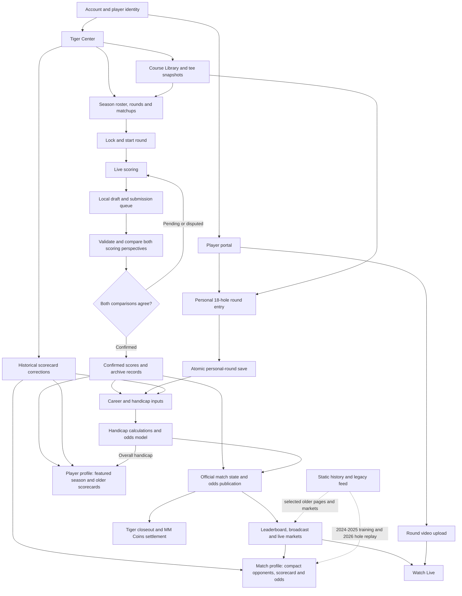

# Maroon Masters: complete application workflow

Reviewed September 18, 2026 against release `ce85a83`. This describes the current implementation, including older data paths and unfinished features. It is not a promise that everything in earlier design plans is implemented.

Open **app-workflow.html** for the interactive version. Select a workflow box to expand its description, or search for a feature or database table.

## Whole-app flowchart

The branches are related but not interchangeable. A personal round is not a tournament submission. Turning on the broadcast does not start scoring. A submitted hole is not necessarily confirmed. A mathematically completed match is not necessarily administratively closed out.

## 1. Accounts, identity, and permissions

The `supabase/player_slots_password_created.sql` migration adds a read-only-in-practice `password_created` boolean to `player_slots` for inspection in Supabase Table Editor. It backfills existing linked accounts and database triggers maintain the value when passwords or `claimed_by` links change, including unlinking/deletion. True means the linked Auth account has a password credential; false means no linked password credential. No password or hash is copied into player data. It does not prove email verification, successful password login, or a portal visit, and does not change the current Claimed label or access rules. Run the migration in Supabase SQL Editor to enable this feature; live execution has not been verified.

After invitation or recovery verification, the Set Password screen shows “Your username is” with the signed-in profile's username and “Or log in with” with the authenticated account's email above the password field. These details come from the verified session, not link parameters. Accounts without a profile username see only the email login option.

A visitor can browse public pages. Signing up creates a Supabase Auth account and a `profiles` row. A reserved MM username can claim an unclaimed `player_slots` entry, linking that account to a particular golfer. An ordinary fan account does not automatically receive player access.

Tiger invitations create a login and linked player profile before the player sets a password. Invite links return session tokens in a browser-only URL fragment. The password form removes that fragment from browser history and posts the tokens to `/api/auth/password-session`, which uses Supabase to establish session cookies. Password-recovery links with a code instead establish cookies in `/auth/callback`. The callback always returns to `/reset-password`. The form verifies the session before enabling Save; expired, incomplete, or failed links show a fresh-password-link option instead of letting the player submit without a session. Recovery links should be requested and opened in the same browser. No email-template or database migration is required for the standard invite flow.

The stable player identifier is a `firstname-lastname` slug, such as `cade-barone`. Display helpers turn it into a first name, last name, or full name. Some historical code still accepts old IDs and first-name aliases. These are compatibility translations, not a safe substitute for identity or permissions.

Player actions use `requirePlayer` to derive the golfer from the authenticated session. Tiger actions check the account's `is_host` permission. Hiding a button is not the authorization mechanism: the server checks access again. Supabase row-level policies provide another boundary; the privileged service-role client stays on the server.

**Input:** account credentials, a profile, and an optional linked player slot. **Output:** public browsing, fan account features, player tools, or Tiger tools. Login, verification, password reset, and logout belong to this layer.

**Code:** `app/api/auth/signup/route.ts`, `lib/portal/requirePlayer.ts`, `lib/portal/requireHost.ts`, `lib/data/players`.

## 2. Calendar year, active season, and broadcast year

Player bios fetch `/api/players/[slug]/handicap` without caching. This returns only the overall index calculated by `combinedHandicapIndexes` from the same submitted and archived round sources as My Handicap; static and approved bio handicap text no longer supplies the displayed number.

Player bio redirects follow the same January 1 upcoming-season switch as the public leaderboard. The featured 2026 page shows only earlier years in its lower scorecard archive; a featured 2027 page shows 2024-2026 there, even before any 2027 scores are posted. The upcoming profile reads `/api/live/players/[player]` from the native confirmed snapshot for the public season, independent of the host's active rehearsal year. Career Stats adds that public season's native match boxes at the switchover. Future seasons beyond the configured next edition still need their tournament definition.

These are three separate controls:

| Context | How its year is selected | What it controls |
|---|---|---|
| Player portal My Matches | Current calendar year in America/Chicago | Which year's match cards appear |
| Native scoring | `live_active_season` | Which tournament receives real scores |
| Broadcast | `broadcast_display_year` | Which season the broadcast displays |
| Historical website page | Tournament slug in the URL | Which archived edition is shown |
| Tiger Master Settings | Year being edited | Which season's setup Tiger is viewing/changing |

Merely browsing a different Master Settings year does not switch the active scoring season. Switching the broadcast year does not move scores to another tournament. Starting a round and marking the broadcast live are also different actions.

For example, in September 2026, My Matches can correctly show 2026 matches as Past while Tiger prepares active season 2027 and rehearses an older broadcast. Supported live-season years are currently a configured range; creating future historical website editions is not automatic.

**Code:** `app/portal/page.tsx`, `lib/live/activeSeason.ts`, `lib/live/seasonYears.ts`, `lib/broadcast/displayYear.ts`, `lib/data/index.ts`.

## 3. Public website and navigation

Home-screen bookmarks use a custom icon: dark maroon `#240001`, matching the scoring portal header, with gold `#C9A86E` Spectral Semibold Italic MM lettering adapted from the broadcast holding screen. The enlarged, vertically extended lettering starts 20% from the left and top, with approximately 20% of the second M cropped at the right edge and 10% of the lettering height cropped below the square. Two fine gold rules across the top and a subtle left rule echo broadcast accents. `app/apple-icon.png` supplies Apple's 180px touch icon; `app/manifest.ts` supplies Android/browser 192px and 512px PNG icons from `public/icons`. The manifest retains browser display mode; this change does not add offline support or redesign the installed layout. Device launchers may apply their own masks. Existing saved icons may need to be removed and re-added after deployment.

On live and archived leaderboards, Match Play boards are centered in a 40vw column at desktop widths (1024px and above), capped at the available content width. Desktop match rows add 10px vertical padding per player name instead of mobile's 6px. The ticker, individual standings, and mobile layout retain their existing sizing.

Home, schedule, teams, players, history, tournament leaderboards, match pages, and player scorecards present tournament information publicly. The official title font is Spectral Bold, matching the Maroon Masters Fantasy heading. Global h1/h2 rules enforce it across page and major section titles, including legacy utility and CSS-module headings; font-title is available for title text outside heading elements. Existing text sizes, colors and capitalization remain as authored. Body text and smaller labels retain their existing fonts. The Schedule tab now opens a photo landing page at `/schedule`, using the supplied Mission Hills image with The Maroon Masters, Mission Hills Country Club, and Palm Springs, CA text. Four bottom links cover January 6-9 of the upcoming tournament year. They open `/schedule/[slug]?date=YYYY-MM-DD`, an eight-session image accordion that initially expands the selected date's first session. Desktop fits all eight strips in one screen: the active panel takes 50% of the width and the other seven share the remaining 50%. Mouse-wheel or trackpad scrolling advances the active session without moving the strip layout offscreen. Mobile aligns the active panel at the top with room for two collapsed panels below, then scrolls vertically. Dates and session labels read horizontally at the top of every strip, explicitly positioned below the fixed controls with white text and a dark shadow for contrast. Clicking a strip or using arrow keys also selects it. Collapsed strips show only date and session; the expanded panel shows course, format, venue, and location. Saved round dates/course/format are used where available; missing rounds use a two-sessions-per-day January 6-9 layout with explicit pending course/format text. Schedule landing and accordion occupy fixed edge-to-edge viewports over the site chrome, with Back controls to leave. Only the mobile accordion and photo-library dialog scroll internally. The accordion replaces tournament branding with a top-center Photo Library button. Course photos are imported from course folders and their nested photo subfolders using `node scripts/import-course-photos.cjs "path/to/MM-Website"`; source files remain unchanged. Main1, Main2, Main3 images are prioritized in that order across repeated course appearances, cycling if needed; other images populate the course library. A checked-in manifest and optimized public WebP files make imported assets available after deployment; later local folder edits require another import. Optional trailing folder names limit the import to named courses. Re-importing a course replaces its Main/library assignments, including when no Main labels remain; then all remaining photos are library photos and the accordion uses its fallback main image. Renamed Photos-suffix entries are consolidated, and content-hashed output URLs refresh changed images without stale browser-cache reuse. Palmer and Pete Dye each currently have two main and four library images. Course names match normalized folder names, with a unique contained-name fallback ignoring a Photos suffix. Unmatched courses retain the Mission Hills fallback and an empty-library message. The unfiltered `/schedule/[slug]` venue pages remain available. Historical editions and much descriptive content originate in committed `lib/data` files. Upcoming venue/dates, round courses/formats, and confirmed roster receive Tiger-managed database overlays where the relevant loaders are used.

The Website / Portal / Scoring selector changes the destination, not the account or database. The More menu contains secondary destinations. Public teams can show locked roster assignments rather than exposing every draft assignment as confirmed.

Historical pages use their own edition's definitions. The current registry explicitly lists 2024-2026 as past tournaments and 2027 as next. Recording future live scores does not by itself create a fully populated new historical website edition.

Some pages are statically generated or cached; others render dynamically or refetch in the browser. A changed database row therefore does not imply that every number on every page refreshes in exactly the same way.

The live leaderboard specifically polls native matches and standings every ten seconds, while also retaining the legacy live-feed loader. Available native matches/standings override that presentation; otherwise feed or historical fallback content can remain. The upcoming tournament's leaderboard route also has a calendar switchover check that can redirect visitors to the latest completed edition before the new season.

Selecting a match in the leaderboard opens its own match profile at `/leaderboard/[slug]/matches/[matchId]`, replacing the historical dropdown and enabling navigation for native live matches. Small Maroon and White header boxes sit above inward-aligned player names (Maroon right-aligned, White left-aligned), retaining profile links. The center displays the Central-time tee time before play, match status and Thru during play, and the final result plus Final afterward. Unknown tee times show TBD. The scorecard follows, then a spaced Match Odds card, then a separate Win Probability card. The white, rounded cards use a compact sportsbook layout on mobile and expand to the available desktop width. Match Odds remains visible before, during and after play; time/status shares the market-header row, Open is unboxed, and Spread/Total/ML have inset outlined cells. Scheduled matches show a circular pre-match display using the latest saved state_thru=0 snapshot, with Maroon and White percentages and a separately identified gold tie segment. Without valid pre-match probabilities, a neutral ring and unavailable message appear instead of invented percentages. Live and final matches continue using the existing hole-by-hole graph and slider. The board is edge-to-edge on mobile and shows tee time (TBD if unknown), Final with the result for completed matches, or Thru for live matches. Maroon and White player rows sit beside Open (opening spread and moneyline), current Spread, Total (over/under birdies across the match), and Moneyline columns. These new market cells are display-only placeholders with no pricing calls or bet actions; Open is reserved for the original opening line, not a later live update. Historical pages read the editable archive by canonical tournament round and use the same basic match table as native profiles, with course name, yardages, par, individual strokes, team rows, running status and published final result: on desktop (1024px and above), a fixed-width, non-scrolling 20-column table (compact row labels, 18 holes, and total). Hole and total columns share the available width equally. The shorter probability graph starts at hole 1 and ends after hole 18, leaving the total column outside the plot; each saved odds update uses its completed-hole boundary, with the latest update retained per hole. Maroon/Tie/White labels occupy the row-label column. The desktop graph shows horizontal guides only, with 0% at the center, 50% midway toward either team, and 100% at either edge. Team labels use translucent colored boxes. An early final win fills the remaining holes on the winning half with a gold-outlined result block (for example, 4&3 after hole 15), covering the horizontal guides there. It uses a thin line, stronger team fills, and no estimated-replay heading. The x-axis labels holes 1-18 at the right edge of each hole column, aligned with the completed-hole slider stops; gold tick marks sit directly above each number. Small marks on the probability line are removed. The slider shares the full 0-18 completed-hole scale with the plot: before play is the left edge, after hole 1 sits directly under label 1 at the boundary between scorecard holes 1 and 2, and after hole 18 is the right edge. Thumb centers align with those boundaries on desktop and mobile, including sparse histories and early finishes. Selecting a hole without a saved snapshot shows no saved odds and blank prices, except that a confirmed final winner carries 100% win probability and 0% for tie and the opponent through hole 18. Those decided points show no betting prices. The graph has one larger black Win Probability heading, without the old Match odds subtitle, and its Maroon/Tie/White summary sits nearby on the left. The board and graph have extra spacing below the scorecard. The Maroon team-name box sits above the upper 100%; the White box below the lower 100% uses white lettering and border over an off-white fill, with a text shadow for legibility. Wins on hole 18 show an unboxed result (such as 1 Up) at the graph's right edge on the winning half. The scorecard status shows Final in the winning team color from the deciding hole through the remaining holes, using the published final winner when available. The far-right total status cell shows the final result (for example 4&3 or 1 Up) in the winner color rather than just Final. Hole, Yards and Par rows are 24px on desktop and 44px on mobile, matching the other mobile rows. The mobile scorecard reaches both viewport edges; its row-label column stays 56px and its total column is 36px, giving more width to the nine visible hole columns on each swipe page. Mobile graph team boxes are slightly smaller and inset from the left edge. The top player panels use maroon fill/white text for Maroon and white fill/maroon text for White. Both the top status and Match Odds header show tee time only before play, only Thru during play, and Final plus the result afterward. The gray graph footer is visually hidden, including its selected-hole summary and explanation; screen readers retain these details and historical estimate provenance. Slider thumbs remain fully visible and draggable at holes 0 and 18. Match and player navigation links say Back. Player links from a match carry a fromMatch query parameter so both historical and native-live player pages return to that match; direct player visits fall back to the tournament leaderboard. Below 1024px, match scorecards use the individual scorecard styling: maroon hole headers, cream score cells and score markers, 56px fixed labels and a 36px total, and two horizontally snapping pages for holes 1-9 and 10-18. All player/team/status rows swipe together. Fourball keeps rows 1-5 (course information and Maroon players), then a separated gold-outlined middle block of Maroon Best Ball, Status, and White Best Ball (rows 6-8), followed by White players (rows 9-10). The separation and outline appear on desktop and across the mobile fixed labels, scrolling holes, and totals. Mobile player and best-ball rows use the same team fills and contrasting score-marker colors as desktop: Maroon fill with white lettering and White fill with maroon lettering. Other formats retain their existing row grouping. Immediately below, the 140px-tall probability plot shows all 18 holes without scrolling, with a 52px left gutter for team and percentage labels. It shares desktop horizontal guides, percentages, team boxes and early-win blocks, with compact labels in the left gutter and odds details above; it does not track the scorecard scroll. Individual player scorecards retain their own layout.

Native match profiles poll `/api/live/matches/[id]?profile=1` every five seconds after each response. The profile payload contains that match's confirmed strokes, course holes, official state, and up to 1,000 recent saved odds updates in chronological order. Unplayed scores remain blank; match status stops at the first gap or mathematical win. Fourball displays individual and best-ball rows; Foursome displays shared side scores. The graph uses a single balance line: Maroon win probability plus half the tie probability. The top is 100% Maroon, the bottom 100% White, and the center represents equal team chances or a certain tie. The separate Maroon, tie, and White probabilities and American prices remain above it; a slider explores updates. Native headers retain the latest odds while historical replay headers follow the selected hole. Failed live refreshes retain the last successful display and show an error. Legacy feed-only match IDs have no native profile data and show an unavailable message.

2026 match pages also provide explicitly labeled estimated replays, computed deterministically from the combined, corrected career archive in `lib/odds/historicalMatchOdds.ts`. Only 2024 and 2025 Singles/Fourball individual scores (excluding nine-hole rounds) train individual strength; Alternate Shot uses prior shared-ball scores, broadening from exact partnerships to partner history when needed. Same-par empirical distributions approximate future holes; missing player history uses the prior field pool. Fourball uses best-ball distributions. This simplified model differs from the live Monte Carlo model and writes no prices or bets. The 2026 hole scores reveal match progress only, never train strength. All replay inputs use the canonical tournament round, after normalizing original workbook numbering at its import boundary. The last point uses the published result, and discrepancies or missing history receive a note. Other historical years still have no odds graph unless recorded data becomes available.

**Reads:** committed tournament/player content plus selected live database overlays. **Writes:** generally none from browsing. **Code:** `app/page.tsx`, `app/leaderboard`, `app/teams`, `app/schedule`, `lib/data/activeSeasonOverlay.ts`.

The portal hero contains two evenly spaced white text links near its bottom: My Handicap retains `/portal/handicap` and Player Lookup opens `/portal/player-lookup`. Both use the bold uppercase serif treatment from the Maroon Masters Fantasy heading, with no filled button backgrounds or borders. Lookup starts directly with the player dropdown below navigation, without a separate page heading or Back link; the navigation back arrow returns to `/portal` on mobile and desktop. Lookup requires a player session, validates the requested player against the static-plus-slot directory, and passes only names/slugs (not slot contact/account metadata) to the client. It displays Maroon Masters handicap left and combined Overall handicap right, using the same archive and submitted-round calculations as My Handicap. Maroon Masters and 20 Most Recent are defaults; Overall, All Scores, Highest to Lowest, and Lowest to Highest reuse the existing history logic. Lookup score views are read-only: no submit action or draft card is rendered. Statistics reuses the profile career-archive statistics categories/year controls and comparison picker, defaulting to the signed-in player when viewing another player. Missing statistics and load failures show explicit states.

The Player Portal navigation rows for Profile, Career, Round video, and Wagers use the corresponding supplied photos from `Player Portal/Profile.Career.etc`, imported as optimized WebP assets in `public/portal/navigation`. Each photo fills a separate rounded row with a gold outline and 12px spacing between selections, with white text and a dark overlay; link destinations and permissions are unchanged.

## 4. Player portal and My Matches

After login, a host goes to Tiger Center. A linked player receives a hero, team label, handicap, match cards, and links to Profile, Career, Round Video, and Wagers. A fan account does not get player-only tools.

My Matches opens on Live after reopening. Live / Upcoming / Past filter cards for the portal's calendar year. For an already completed registered year, historical match definitions and archived scorecards construct those cards. Otherwise, the portal reads native rounds and match boxes. An empty Live tab can be correct even when Past contains matches.

Opening actual scoring requires a scoreable assigned match in the active scoring season. A displayed historical match is not an invitation to resubmit that old tournament through live scoring.

The portal hero stacks **2026** above **Skins** to the left of a total as tall as both labels, directly below the overall handicap. The entire skins summary links to `/portal/skins`. `lib/skins/data.ts` reads the complete paginated 2026 `archived_scorecard_rounds` and `archived_scorecard_holes` on the server, so historical corrections are reflected on the next page load. `lib/skins/calculate.ts` compares gross strokes across all individual scorecards for the same session and canonical course, hole by hole. A sole lowest score earns one skin; a tied low earns none, with no carryover or handicap adjustment. Singles and individual-ball Fourball count; shared-ball formats do not. A hole is skipped if any participating card lacks a valid positive integer score; single-player fields and duplicate player cards cannot award skins. Players with cards but no wins show zero; absent cards or load errors show a dash. The display is explicitly fixed to 2026. Confirmed live 2027 data is not connected yet; personal handicap rounds do not contribute.

The player-only `/portal/skins` page uses the Fantasy heading and underline-navigation style with **Skins** and **Payout** destinations. The leaderboard sorts by total skins descending (names break ties), with Player name, Total skins, and $ Earned columns. Clicking a player expands winning holes directly below that row: Day, numbered Session with Morning/Afternoon, canonical Course, Hole, and gross Score with the existing scorecard shape and a word such as Birdie or Par. Day/session labels use the historical tournament session sequence, including shared-ball sessions in its numbering. Missing par is labeled explicitly without guessing a shape. Zero-skin players remain listed with an empty-details message. Both totals and details use the same calculation; load failures show an unavailable state.

For 2026, entry is **$100 per player**, and each of the six individual-ball Fourball/Singles sessions (1, 3, 4, 5, 7, 8) has its own **$200 pot**, totaling **$1,200**. `lib/skins/payout.ts` splits each round pot across that round's skins, then sums each player's shares for $ Earned, before their entry fee. Earnings use integer cents with largest-remainder allocation (player slug breaks equal remainders), so a round with winners distributes exactly $200. The Payout view shows entry, pot per round, total pots, and a round-by-round skins/pot/per-skin table. Per-skin values are rounded for display. A round with no skins leaves its pot unawarded; no carryover is implemented. These are calculated earnings, not payment collection, payment-status tracking, or transfers. No database migration is needed, and 2027 remains unconnected.

The portal hero uses the same combined overall handicap calculation and `formatHandicapIndex` display helper as My Handicap. Its larger, number-only link sits at the top right and opens the Overall tab: a calculated -1.4 displays as +1.4, positive indexes display without a sign, and unavailable indexes display a dash. The separate gold-bordered Submit a score pill sits between My Matches and the Profile/Career/Round video/Wagers box, matches that box's width, and opens the handicap screen.

**Reads:** profile, match data, scorecards, personal rounds, and eligible archive rounds. **Code:** `app/portal/page.tsx`, `components/portal/PortalMatches.tsx`, `lib/portal/liveMatchCards.ts`, `lib/portal/archivedMatches.ts`.

## 5. Player profile edits

The editor loads the original player profile, merges approved overrides, and shows pending proposals separately. Submitting a bio change writes a proposal to `player_profile_edits`; it does not immediately replace the published biography.

Tiger can approve or deny a proposal and can set an override directly. Approved values are merged by the profile-loading helpers. Only allowed fields can be proposed. A biography or display-name edit does not change score ownership or the canonical player slug.

**Flow:** player proposal → pending edit → Tiger decision → approved override → profile display. **Code:** `app/api/portal/profile/route.ts`, `app/api/portal/tiger/profile-edits`, `lib/data/players/overrides.ts`.

## 6. Tiger Center and tournament preparation

Tiger Center separates year-specific tournament operations from global tools. Season setup contains roster, teams, venue/dates, round count, round schedule, formats, tee times, and matchups. Global tools include Course Library, Career Stats, scorecard administration, Odds Model, Wager Types, Broadcast Controls, and the Live Scoring Page Editor.

The preparation sequence is:

1. Select the intended season and confirm which season is active for real scoring.
2. Assign players and teams; lock assignments intended to be published.
3. Configure each round's date, format, course, and tee setup.
4. Create match boxes with the correct players on each side and tee times.
5. Lock the course and matchups.
6. Start the round when play should be enabled.

Singles has one player per side. Fourball and Foursome have two per side. Match/roster validators enforce the relevant assignment rules. These setup steps are separate state changes, not one universal Publish Everything action.

**Writes:** `live_tournament_settings`, `live_roster`, `live_roster_assignment_locks`, `live_round_state`, `live_match_boxes`. **Consumers:** public upcoming schedule/roster, player match discovery, scoring, and tournament calculations.

**Code:** `app/portal/admin/page.tsx`, `app/api/portal/tiger/master-settings`, `app/api/portal/tiger/rounds`, `app/api/portal/tiger/matchboxes`.

## 7. Course Library, tees, and historical snapshots

A library course is a reusable identity with named tee configurations. A tee setup provides hole numbers, pars, yardages, course rating, and slope. Imports help populate these fields. A similar course name does not prove which tee box was played in a past round.

When a round chooses a locked setup, the server resolves the library tee and takes a snapshot. The shared Round & Format source is `round_format_setups`, keyed by season year and round. It currently applies one setup to the whole field for that round; it is not a per-player tee override system.

Future live rounds automatically populate/update live-sourced snapshots when course and matchups are locked before play. After play starts, ordinary library changes do not rewrite historical snapshots. Explicit archive assignments are preserved separately from automatic live setup updates.

Course aliases connect older labels to library identities. Missing tee, date, rating, or slope is not invented. The handicap eligibility code rejects setups with differing hole tee IDs; mixed tees need an appropriate verified composite design. Players using different tees within the same round need an additional override mechanism.

**Flow:** reusable library → selected locked tee → round snapshot → historical display and handicap metadata. **Code:** `lib/data/roundFormatSetups.ts`, `lib/data/courseLibraryMatch.ts`, `supabase/round_format_setups.sql`.

## 8. Starting a round and opening scoring

Tiger starts a round after its course and matchups are locked and match boxes exist. `start_live_round_atomic` changes the round and match-box started flags in one transaction. Failure cannot leave only half of that start operation committed.

A started round can still contain matches waiting for tee time. A match becomes scoreable when its start conditions and tee time are satisfied, or Tiger explicitly starts that match. Final matches are closed to entry.

The player's scoring entry point finds the lowest relevant locked round containing that player whose match is not final. Without an appropriate live match, it shows the scoring landing state instead of allowing arbitrary score entry.

Starting the round also attempts a broadcast event, but broadcasting and scoring remain independent controls.

**Code:** `app/api/portal/tiger/rounds/start/route.ts`, `lib/live/currentRoundForPlayer.ts`, `app/portal/scoring/play/page.tsx`.

## 9. Live hole entry and local drafts

The phone shows hole/par/yards, running totals, the horizontal hole selector, the scorer's score slider, the assigned opposing player's score slider, and applicable personal statistics. Team-colored rows put the scorer's side first. Par-three fairway is N/A. Putts retains the requested 4+ choice.

In Singles/Fourball, a player records their own score and the assigned opposing player's score. Fourball scoring pairs are position-based within the two sides. Putts, fairway, and green refer to the scorer's own ball. Foursome uses shared side scores and omits individual-ball shot statistics.

Changing a control writes a browser draft scoped to player and match. **Next Hole only navigates. Submit Score validates, submits, and advances after a successful response.** Actual strokes are not capped at double par; the slider has 1-20 plus Other score for larger values.

Drafts survive reloads in that browser. They are not cloud backups, and the app still needs server-provided match/setup data to open normally. This is not a fully offline-installed application.

**Code:** `components/portal/ScoringPanel.tsx`, `components/portal/ScorePicker.tsx`, `lib/usePersistentState.ts`, `lib/live/holeSubmission.ts`.

## 10. Submission, agreement, disputes, and retry

An explicit submission is queued locally with a unique request ID and the last saved timestamp. The API derives player identity from the session. The database verifies the match, season, membership, start/lock conditions, scores, and required statistics under a match lock.

The transaction records the scorer's perspective and compares both score values against the opposing perspective. An identical successful retry returns its receipt rather than creating a duplicate. A stale write from another device is rejected for review.

| State | Meaning | Archive effect |
|---|---|---|
| Draft | Changed locally; no explicit submission | None |
| Queued | Submit was requested; delivery is unresolved | Not proof of confirmation |
| Submitted | This perspective was saved; the other may be missing | Unconfirmed holes excluded |
| Confirmed | Both score comparisons agree | Eligible confirmed holes mirrored |
| Disputed | Either comparison disagrees | The pair's archived holes retracted |
| Edited after submission | Local values differ from the saved version | Requires resubmission |

Correcting and resubmitting matching values restores the archive entries. Red marks a discrepancy. Maroon submission styling alone is not proof that both players have confirmed it.

Network/server failures retain the queue and retry while the page is open, on reconnection, or after reopening online. Reviewable client errors stop the queued attempt while retaining the draft. Editing a queued hole cancels that older queued version. Successful saves are acknowledged before background model calculations finish.

**Writes:** `live_hole_submissions`, `live_hole_scores`, `live_submission_receipts`, audit records, and triggered archive updates. Full 18-hole confirmation also updates round-submission tracking. **Code:** `lib/live/useHoleQueue.ts`, `app/api/portal/scoring/hole/route.ts`, `supabase/live_hole_submissions.sql`, `supabase/scoring_reliability.sql`.

## 11. Match results, standings, and published odds

The shared native snapshot paginates every source, including confirmed hole scores, so a full field cannot silently lose scores beyond the database's 1,000-row response limit. Player profiles, native match scorecards, standings, broadcast and publication use this snapshot. Source query failures surface as errors rather than an apparently empty tournament. Upcoming public player profiles no longer use the legacy sheet feed.

Confirmed live scores feed the native tournament snapshot. Singles compares two scores. Fourball uses the best score on each side. Foursome compares the shared side scores. The match calculation processes contiguous completed holes and stops at the first mathematical win; later stroke scores cannot reverse that result.

A completed match awards one team point to its winner, or half a point each for a tie. Own-ball gross and score-to-par statistics are separate calculations. Foursome team scores are excluded from individual stroke-performance samples.

Score changes create durable `live_publication_jobs`. Publication derives `live_match_official_state` and a model-produced `live_match_odds_snapshots` row. They commit together only if the score revision still matches, preventing slower old calculations from overwriting newer results.

The scoring API starts publication after acknowledging the hole. Scoring-state, public match, and standings requests retry unfinished jobs. These retries are activity-driven; this release has no independent scheduled publication worker. Some displays derive directly from confirmed snapshots, while match/odds APIs read stored publication results.

**Code:** `lib/broadcast/liveSnapshot.ts`, `lib/live/scoring.ts`, `lib/live/orchestration.ts`, `lib/live/publishOfficialMatchState.ts`, `lib/live/retryPublication.ts`, `app/api/live`.

## 12. Tiger closeout and final settlement

Mathematically complete and administratively closed out are different states. Players may continue actual stroke scoring after the match is decided until Tiger closes it. Tiger's closeout cards identify complete published matches and refresh periodically.

Closeout recomputes the contiguous confirmed result in the database. It saves final official state, marks the match Final, marks its archive rounds final, records an audit event, and settles that live-match MM Coins market in one transaction.

If settlement fails, the entire closeout rolls back. Retrying a successful closeout does not pay twice. An early finish is allowed once the lead exceeds holes remaining, but no unplayed holes are invented. A partial round does not become a complete handicap round.

This finalizes one match and its associated market. It does not automatically create a historical website edition, settle every unrelated future/prop, or implement a dedicated pickup/concession workflow.

**Code:** `components/portal/tiger/MatchCloseoutCards.tsx`, `app/api/portal/tiger/matchboxes/closeout/route.ts`, `supabase/scoring_reliability.sql`.

## 13. Personal round submission outside a tournament

**Flow:** Course → Tee/date/time → 18 hole entries → Review → Submit Round.

This shares the live scoring controls but removes the opposing score, live hole selector, and per-hole Submit Score button. Final review is the round-level submission point. It does not require an opponent's agreement or affect tournament match points.

The player enters actual score, putts, fairway, green, and required miss directions. Par-three fairway is not applicable. Missing entries block review/submission instead of silently becoming zero putts or missed shots. Drafts are retained in the browser.

The server validates all holes, resolves the selected library tee itself, computes the total and differential, and snapshots the tee metadata and hole setup. `handicap_rounds` and all `handicap_round_holes` save atomically. An identical retry returns the existing round through its submission ID.

These rounds feed the overall handicap and the combined Career Archive's personal/Other input. That does not mean every older public career summary includes them.

**Code:** `components/portal/handicap`, `lib/handicap/data.ts`, `lib/handicap/validate.ts`, `app/api/portal/handicap/rounds/route.ts`.

## 14. Differentials, handicap selection, and asterisks

The app computes:

`Differential = ((gross score - course rating) × 113) / slope`, rounded to one decimal.

Example: 78 against rating 74.0 and slope 133 produces **3.4**. This describes the implementation, not an official GHIN certification.

Tournament archive eligibility requires 18 individual-ball holes, a date, and verified tee/rating/slope metadata. Foursome and incomplete rounds do not qualify. Future archive readers also exclude did-not-finish entries. A matched course name alone does not establish eligibility.

The overall index combines personal and eligible tournament rounds, orders them newest first, keeps up to 20, selects the lowest differentials using this table, averages them, applies the adjustment, and rounds to one decimal:

| Available rounds | Lowest differentials used | Adjustment |
|---|---:|---:|
| Fewer than 3 | No index | — |
| 3 | 1 | -2.0 |
| 4 | 1 | -1.0 |
| 5 | 1 | 0 |
| 6 | 2 | -1.0 |
| 7-8 | 2 | 0 |
| 9-11 | 3 | 0 |
| 12-14 | 4 | 0 |
| 15-16 | 5 | 0 |
| 17-18 | 6 | 0 |
| 19 | 7 | 0 |
| 20 | 8 | 0 |

The asterisk identifies rounds selected for the displayed overall or MM-only calculation. MM-only excludes personal rounds. Low Index still replays available history and takes the lowest calculated index internally, but is no longer shown on My Handicap. My Handicap displays a negative calculated index as a plus handicap; a differential retains its mathematical sign.

The current math uses raw gross, not a net-double-bogey adjusted gross. It does not implement PCC, official soft/hard caps, exceptional-score adjustment, GHIN synchronization, or a nine-hole expected-score conversion. Its Low Index is an available-history minimum, not a separately maintained official rolling Low Handicap Index.

**Code:** `lib/handicap/whs.ts`, `lib/handicap/archiveIndex.ts`, `lib/handicap/futureRounds.ts`, `lib/handicap/format.ts`, `components/portal/handicap/HandicapHome.tsx`.

## 15. Archives, corrections, and career statistics

**September 22 implementation (database application pending):** Every source now has an explicit round boundary in `lib/data/roundIdentity.ts`. Original Danzante card numbers map to 1/INDI/3/5/6; Palm Springs cards map to 1/3/4/5/7/8. Generated Pinehurst career records omit the Cradle, so workbook rounds 3 onward map one round later; generated Palm Springs rounds 5/6 swap to match the scheduled Fourball/Alternate Shot sessions. Database and native live rows already use canonical IDs and are never renumbered again on read.

Career Stats match boxes link to their match page. Those pages read the same editable individual holes as player profiles; shared Alternate Shot balls come from separate team records. Pinehurst's Cradle match lists its actual four players per side and its best-three-of-four scores across nine holes. The profile archive can display these nine-hole scorecards without adding them to handicap or the odds training pool. The published historical result remains authoritative when source strokes disagree; the 2026 replay labels such discrepancies.

`scripts/repair-historical-archive.ts` exports a full backup, matches source scorecards by ordered hole scores, checks ancillary stats/edits/video dependencies, and generates transaction SQL. The tested plan retains 159 source rounds (47 Pinehurst, 40 Danzante, 72 Palm Springs), removes 40 identical duplicate rows, preserves the surviving hole records and all three video records, and assigns the existing verified round tees/dates. The SQL locks the affected tables, rejects stale exports, retains a private recovery snapshot, verifies the entire resulting dataset, and is idempotent. It must be executed with a database SQL connection; generation and local PostgreSQL verification are not a live repair. The old renumber scripts now stop immediately. The legacy importer exports insert-only SQL with canonical round numbers; it never overwrites existing rounds or edits.

**September 21 audit:** The configured database contains mixed legacy and corrected round identities for 2025/2026. A read-only all-player audit found 56 Danzante individual scorecards for 40 source rounds and 96 Palm Springs scorecards for 72 source rounds. At the time of that audit, the legacy importer could overwrite corrected round keys, while the handicap loader joins setup by year/round and can consequently display the wrong course and exclude valid individual scores as Alternate Shot. The separate Career Archive round namespace also required reconciliation, now implemented at its source boundary. Findings and a repair plan are saved in `docs/historical-handicap-repair-handoff.md`; reproducible evidence is in `docs/historical-handicap-audit.json` and `scripts/audit-historical-handicap.ts`. No database repair or deployment was performed for this investigation.

The archive is a family of sources, not one universal table:

| Source | What it holds |
|---|---|
| Committed tournament files and generated career data | Imported historical editions and model records |
| `archived_scorecard_rounds` / `archived_scorecard_holes` | Editable historical player scorecards |
| `round_format_setups` | Shared course, date, and tee snapshots |
| `career_archive_rounds` / `career_archive_live_holes` | Native live-round metadata and confirmed individual holes |
| `career_archive_team_holes` | Shared-ball team observations |
| `handicap_rounds` / `handicap_round_holes` | Personal submitted rounds |
| Legacy `career_stat_*` tables | Workbook-imported career datasets used by some readers |

Tiger's historical scorecard edits save as a transaction. The combined Career Archive replaces an imported individual round with its editable counterpart, including removal of obsolete imported holes. It combines historical, live, and personal inputs while keeping team observations separate. Large archive readers paginate instead of truncating at 1,000 rows.

This combined loader feeds Tiger Career Stats, the Odds Model, and live odds publication. Public archived-score/stat APIs also apply historical overrides but use a different composition that does not add personal rounds. Some older career summary tables and archived broadcast summaries still read committed per-year data directly.

Consequently, an edit is not guaranteed to change every historical number everywhere. Database scorecards, combined model inputs, static yearly summaries, and archived broadcasts must be distinguished. A complete single-source conversion of all older presentation surfaces has not been done.

Round & Format metadata supplies course/tee/date information; it is not the table containing every player's scores. Workbook import is an administrative ingestion path, not a spreadsheet consulted during each live submission.

**Code:** `lib/data/combinedCareerArchive.ts`, `lib/data/careerStatsDatabase.ts`, `lib/data/mergeCareerRecords.ts`, `lib/data/archivedScorecards.ts`, `components/stats/PlayerCareerPage.tsx`, `lib/broadcast/leaderboardData.ts`.

## 16. Odds model and simulator

The simulator combines scoring history with the target course's holes, format, sides, completed holes, and current lead. It samples historical scores by hole characteristics, applies round-shape/format calibration, and simulates possible remaining outcomes.

Singles models two players. Fourball models four players and uses each side's best score. Foursome uses player histories with shared-team/pair calibration. Outputs are Maroon-win, tie, and White-win probabilities, converted to fair American odds without an added sportsbook margin.

Live publication calls the same model family and stores a snapshot. Tiger's simulator is an inspection/hypothetical calculation tool; changing its inputs does not submit real scores or settle bets. Missing setup or insufficient samples can produce no model result.

Model eligibility differs from handicap eligibility. Personal Stroke Play requires a complete 18-hole round. Singles/Fourball and confirmed live holes follow their own filters. The current filter excludes records whose `roundHoles` equals nine, including a live round exactly nine holes through. This deserves review rather than assuming every partial live round always enters the model.

**Code:** `lib/odds/preRoundSingles.ts`, `lib/live/publishMatchOdds.ts`, `app/portal/admin/odds-model/page.tsx`.

## 17. Wagers, MM Coins, and the portfolio

An authenticated account chooses a market, selection, and stake. It need not be linked to a player. The server resolves the selection and offered odds rather than accepting arbitrary browser-supplied odds.

Native live-match markets read official match state and the latest odds snapshot. Markets marked complete or closed_out are rejected. The betting RPC records selection, odds, stake, potential payout, and pending status while changing the account balance. Portfolio and coin leaderboard read those bet/account records.

Tiger closeout settles the associated live-match market: winning pending bets receive their stored payout, losing bets become lost, and `wagers_market_settlements` prevents duplicate settlement. Other markets have their own settlement path; one match closeout does not settle every tournament future.

Market sources are still mixed. The bet route first checks the legacy-feed market catalog before its native live-match fallback. Wager Types defines/publishes rulebooks, but several items are explicitly `in_design`. A named card or published definition does not prove its calculation and settlement are implemented.

The verified functioning currency path is MM Coins. This map does not describe a real-money deposit, withdrawal, or payment-processing service. Older/mock market presentations are not universally driven by the new stored live odds.

**Code:** `app/api/wagers/mm-coins/bet/route.ts`, `lib/wagers/marketKeys.ts`, `lib/wagers/liveMatchMarket.ts`, `lib/wagers/publicWagerCatalog.ts`, `supabase/schema.sql`.

## 18. Broadcast engine and producer controls

The bottom-left leaderboard ticker shows the top five in a content-sized strip capped at the viewport width. It is at least 112px tall (roughly twice its previous height), with larger vertically centered names, placements and scores; text scales down together when space is limited. It hides while the individual leaderboard is visible and returns for holding, match play, player videos, transitions and full-screen event takeovers.

Tiger controls display year, auto/producer mode, scene timing, pause state, announcements, playlist behavior, and tournament-live presentation. `broadcast_state` and `broadcast_config` hold these controls. The normal broadcast follows its configured display year; host previews support separate rehearsal inputs.

The scene layer displays holding content, individual leaderboard, and match play, with supported event overlays/takeovers and queued player-video transitions. Live data refreshes through Supabase Realtime notifications followed by API refetches, with visibility/reconnect recovery. Archived-year scenes use historical data sources.

The event queue selects active, unexpired rows using effective priority and age. An event type existing in the library does not prove every scoring path emits it. The atomic hole endpoint publishes official state/odds but does not directly call `publishBroadcastEvent` for every score. Standings may update without every potential celebratory event firing.

Broadcast consumes tournament data. Changing its year, scene, or live flag does not submit scores, start a tournament round, or change handicap calculations.

**Code:** `lib/broadcast/state.ts`, `lib/broadcast/queue.ts`, `lib/broadcast/useLiveBroadcastData.ts`, `components/broadcast/BroadcastStage.tsx`, `app/portal/admin/broadcast-controls`.

## 19. Watch Live, comments, and highlights

Separately, the home Silver Springs hype tile opens `/videos/hype-1`. Its native video player loads `MM Edit - Silver Springs.mp4` directly from the public `website-media` R2 bucket at `https://pub-6a86d18bc79d43b99b2c02fa816169dc.r2.dev/MM%20Edit%20-%20Silver%20Springs.mp4`. The thumbnail remains bundled with the website; the MP4 is not tracked in Git. This uses the public development endpoint, not a production custom media domain.

Watch Live is the public viewing page. If a YouTube live video ID is configured, it embeds that video. Otherwise, when Tiger marks the broadcast live, it displays the app's custom broadcast. Before that it shows countdown/holding content.

The viewer follows broadcast-state and playlist changes. The custom output consists primarily of tournament graphics and queued media; it is not itself a complete camera-stream ingestion/production service.

Comments and Highlights are currently placeholder panels: they display explanatory text, not a functioning realtime chat backend or automatically generated highlight collection. They must be distinguished from the functioning broadcast-state and video presentation paths.

**Code:** `app/watch-live/page.tsx`, `components/watch-live/WatchLiveExperience.tsx`, `components/watch-live/BroadcastPlayer.tsx`.

## 20. Round videos and stored media

A player can attach shot video to their own eligible archived scorecard; Tiger can manage others. An authorized request obtains a signed upload URL, and the browser uploads bytes directly to Cloudflare R2. A confirmation request then validates the player/round/hole/shot and saves the storage-object link in Supabase.

The scorecard can display the linked video, and the confirmation path can queue it for the broadcast. Video bytes live in object storage; ownership and scorecard references live in the database. Uploading video does not change strokes, resolve a scoring dispute, or create a missing historical round.

The current linking route specifically looks for `archived_scorecard_rounds`. Do not assume that every future native live archive round automatically supports the same upload path. Playlist audio and video presentation metadata are separate from tournament results.

**Code:** `app/api/portal/tiger/scorecards/video/sign/route.ts`, `app/api/portal/tiger/scorecards/video/confirm/route.ts`, `lib/r2/client.ts`, `lib/broadcast/playerVideoQueue.ts`.

## 21. Live Scoring Page Editor and test season

The editor displays two connected sample phones, Maroon and White. Submitting both demonstrates agreement, disagreement, correction/resubmission, team styling, and the compact mobile layout. Desktop places them side by side; mobile stacks them.

It uses local sample state and shared scoring components. It does not call the real live-hole API or save real scores. It is a visual rehearsal surface, not a general drag-and-drop layout editor; layout changes still require code.

The separate test-season controls operate on a designated database season. This is different from local preview. Test data is excluded from normal combined archive/model reads unless the relevant loader explicitly opts into test data. Resetting the test season is a host action.

**Code:** `components/portal/tiger/LiveScoringPreview.tsx`, `components/portal/tiger/ScoringPreviewPhone.tsx`, `components/portal/tiger/TestSeasonPanel.tsx`, `lib/live/testSeason.ts`.

## 22. Legacy integrations and unfinished pages

Current native scoring uses the Supabase transaction path. The repository still contains the older `PlayerScoringPanel`, `/api/portal/score` routes, `LIVE_FEED_URL` integration, and Python API client. The old panel is not mounted by the current app routes found in this review, but some external-feed consumers and endpoints remain.

The obsolete native stroke/stat autosave endpoints reject requests, preventing them from bypassing complete-hole submission. That does not mean all older external integrations have been removed.

Fantasy, Merchandise, Vault, Settings, My Team, and Sponsorship currently render Coming Soon. GPS shows a notice rather than distances. Dedicated pickups/concessions are not a complete workflow. A destination, schema field, or old design document is not proof of a complete connected feature.

**Code:** `components/portal/PlayerScoringPanel.tsx`, `app/api/portal/score`, `lib/scorekeeper`, `lib/data/fetchLiveTournament.ts`, `components/portal/HoleActionBar.tsx`, the corresponding placeholder page files.

## 23. Hosting, storage, and release workflow

| Component | Responsibility |
|---|---|
| Browser | Interface, local drafts, retry queue, some preferences |
| Vercel / Next.js | Website rendering and API routes |
| Supabase Auth | Sessions and account authentication |
| Supabase PostgreSQL | Scores, setups, archives, profiles, wagers, transactions |
| Supabase Realtime | Change notifications that trigger refetching |
| Cloudflare R2 | Uploaded media files |
| GitHub | Code, migration files, committed historical data |

Database migrations and website deployments are separate. Deploying code does not automatically run the SQL files. For a required additive migration: test code/SQL → apply migration → verify functions → deploy matching code → verify production domain assignment → smoke-test live endpoints.

Vercel Preview and Production have separate environment-variable scopes. The earlier preview failed for missing Supabase settings; production succeeded with its configured settings. A staged Ready build does not necessarily mean the live domain points at it.

**Code:** `package.json`, `lib/supabase`, `lib/r2`, `supabase/*.sql`, `docs/scoring-reliability-release.md`.

## 24. One hole, end to end

1. Tiger locks the round's setup and matchups, starts the round, and its tee-time/start conditions open scoring.
2. Cade records his score, the assigned opponent's score, and his own statistics. These are browser drafts until Submit.
3. Submit sends a uniquely identified request. The server validates and commits the saved perspective.
4. If the opponent is missing, it waits. If either score comparison disagrees, the pair remains disputed and is excluded/retracted from the confirmed archive.
5. Matching submissions confirm the holes. The phone receives acknowledgment; background publication updates official state and odds. Live consumers refresh their appropriate data.
6. If the match is mathematically won, that result stops changing. Players may record further actual strokes until Tiger closes the match.
7. Tiger closeout atomically finalizes the match and settles its MM Coins market.
8. If the individual round has all 18 eligible holes and verified tee/date data, it can contribute a handicap differential. A partial or shared-ball round cannot become a complete individual handicap round.

## Review findings

This map identifies remaining distinctions worth reviewing: static versus corrected career summaries; independent year controls; model exclusion at exactly nine holes; incomplete event emission wiring; legacy market/feed consumers; future live-video/archive-edition transitions; and unfinished GPS, placeholders, pickups, and official full-handicap features.

These are observations from the documentation review. No application behavior was changed while creating this map.

## What changed

**2026-09-24 - Darker, oversized home-screen artwork (implemented; deployment not verified).** The earlier maroon icon had vertically centered gold MM lettering. It now matches the scoring header's dark maroon, adds fine broadcast-style gold rules, and extends the MM from 20% below the top through a 10% bottom crop while retaining the right-edge crop. Updated section 3 and the Mermaid annotation; workflow paths are unchanged.

**September 24, 2026 - Official Maroon Masters title font (presentation change implemented locally; deployment not verified).** Major titles previously mixed sans-serif, condensed and serif faces. Page and section headings (h1/h2) now consistently use Spectral Bold, matching Maroon Masters Fantasy. A reusable font-title token supports non-heading titles. Existing sizes, colors and casing remain unchanged. Updated Section 3 and the flowchart annotation; overview mappings are unchanged.

**2026-09-24 - Home-screen icon (implemented; deployment not verified).** Previously, home-screen saves had no dedicated Apple icon or Android manifest icons. They now use a maroon square with the broadcast's italic MM in gold, shifted right with an intentional crop. Updated section 3 and the Mermaid annotation; application workflow paths are unchanged.

**September 24, 2026 - Skins leaderboard and round payouts (implemented locally; deployment not verified).** The hero previously showed an unlinked 2026 skin count. It now stacks the year above Skins next to a larger total and opens a player-only leaderboard with Fantasy-style Skins/Payout navigation. Player rows expand into winning-hole day, session, course, hole, score shape, and score name. The $ Earned column and Payout view calculate each player's share of separate $200 Fourball/Singles round pots, with a $100 entry per player; the six 2026 pots total $1,200. Updated Section 4 and the portal flowchart annotation; overview mappings are unchanged.

**September 24, 2026 - 2026 player skins (implemented locally; deployment not verified).** The portal previously displayed only the overall handicap in the top-right stats area. It now adds the year above a Skins label and total below handicap, calculated from archived individual scores across each session/course. Ties earn no skin, incomplete holes are skipped, and 2027 remains a future integration. Updated Section 3 and the flowchart annotation; overview boxes and workflow mappings are unchanged.

**September 24, 2026 - Portal hero navigation links (presentation change implemented locally; deployment not verified).** My Handicap and Player Lookup previously appeared as stacked pill buttons below the hero. Both now sit inside the hero near its bottom, evenly spaced in two columns, as white text links using the Fantasy heading font treatment. Destinations are unchanged. Updated Section 3 and the flowchart annotation; overview mappings are unchanged.

**September 24, 2026 - Compact Player Lookup header (implemented locally; deployment not verified).** Removed the separate Back link and Player Lookup heading, moving the player dropdown and remaining content upward. The navigation back arrow is visible on mobile and desktop and always returns to the Player Portal home from lookup. Updated Section 3 and the flowchart annotation; overview mappings are unchanged.

**September 24, 2026 - Player Lookup and My Handicap entry (implemented locally; deployment not verified).** Renamed the portal Submit a score entry to My Handicap without changing its destination, and added Player Lookup below it. Players can select another player, read both handicap indexes and filtered round history, and open the existing profile statistics comparison with themselves preselected. Authenticated lookup reads player handicap history but provides no editing/submission controls; slot contact metadata is excluded from the client payload. Updated Section 3 and the flowchart annotation; overview mappings remain unchanged.

**September 24, 2026 - Separate gold-outlined portal selections (presentation change implemented locally; deployment not verified).** The four photo links previously shared one border with dividers. Each now has its own rounded gold outline and a 12px gap from the next selection. Updated Section 3 and the flowchart annotation; navigation and overview mappings are unchanged.

**September 24, 2026 - Player password status (migration prepared and locally tested; live execution pending).** Previously player slots exposed invitation/link status but no password indicator. The new migration adds and backfills `password_created`, then automatically maintains true/false from the linked Auth account's password credential. Existing accounts are included regardless of invitation history. Updated Section 1 and the flowchart annotation; overview mappings are unchanged. This does not track portal visits or change Claimed semantics.

**September 24, 2026 - Show login details during password setup (implemented locally; deployment not verified).** Previously the password screen did not tell invited players their assigned username. It now shows the verified account's username and email as alternative login options above the password field. Updated Section 1 and the flowchart annotation; overview mappings are unchanged.

**September 24, 2026 - Repair invitation password setup (implemented locally; deployment not verified).** Previously invitation session tokens were ignored and Save could fail with “Auth session missing.” The password form now exchanges invite tokens for server session cookies, clears the URL fragment, and verifies the session before enabling Save. Recovery-code errors and invalid links now show a new-link option; callback redirects are restricted to the password page. Updated Section 1 and the flowchart annotation; overview boxes and mappings are unchanged.

**September 24, 2026 - Player Portal navigation photos (implemented locally; deployment not verified).** The four plain navigation rows now use the supplied Profile, Career, Round Video and Wagers photos, with white text and contrast overlays. Existing destinations, row sizing and permissions remain unchanged. Updated the guide and flowchart annotation; overview mappings are unchanged.

**September 24, 2026 - Restore clear accordion date/session labels (implemented locally; deployment not verified).** The full-screen overlay change left labels dependent on button padding and small responsive text. Labels now have explicit positioning below the controls, consistent readable type, and contrast shadows; collapsed mobile rows keep their centered horizontal labels. Updated Section 3 and the flowchart annotation; overview mappings are unchanged.

**September 24, 2026 - Refresh Palmer and Pete Dye course photos (implemented locally; deployment not verified).** Imported two main and four library photos per course from the new nested folders. The importer now supports photo subfolders, targeted course refreshes, consolidated Photos-suffix names, and replacing main assignments even when all Main labels are removed. Image URLs use content hashes so replacements refresh correctly. Desktop folders still require an explicit import; source files remain untouched. Updated Section 3 and the flowchart annotation; overview mappings are unchanged.

**September 24, 2026 - Fixed schedule screens and course photo libraries (implemented locally; deployment not verified).** Schedule screens previously occupied normal page flow with surrounding chrome. They now fill the viewport without outer scrolling; Back controls exit and the accordion retains internal navigation. Photo Library replaces the accordion tournament heading and opens an accessible course-specific dialog. A course-folder importer prepares prioritized Main1/2/3 images separately from other library photos, preserving source files. Imported assets are static deployment inputs, not a live desktop-folder connection. Updated Section 3 and the flowchart annotation; overview mappings are unchanged.

**September 24, 2026 - Schedule accordion proportions (implemented locally; deployment not verified).** Desktop previously scrolled wide panels offscreen; all eight now fit together, with 50% width for the active session and 50% shared by seven collapsed strips. Labels are horizontal at the top. Mobile aligns the active session at the top with two collapsed rows below. Landing-page dates still select the first session on that date. Updated Section 3 and the flowchart annotation; overview mappings are unchanged.

**September 24, 2026 - Eight-session schedule image accordion (implemented locally; deployment not verified).** Day links previously opened a simple round list. They now open an eight-panel photo accordion at that date's first session. Desktop expands vertical strips horizontally; mobile expands stacked panels while scrolling down. Strip buttons and arrow keys provide alternate navigation. Configured course/format/date appear in the active panel, while missing details remain explicitly pending. The existing photo is reused pending session-specific photos. Updated Section 3 and the flowchart annotation; overview mappings are unchanged.

**September 24, 2026 - Schedule photo landing (implemented locally; deployment not verified).** The Schedule tab previously redirected to the upcoming venue list. It now opens a full-width photographic landing using the supplied Schedule Landing Page Photo, with tournament branding, Mission Hills Country Club, Palm Springs, CA, and January 6-9 day links. The links use basic date-filtered views of existing round setup; detailed day-page design is still pending. The supplied PNG is served as an optimized WebP. Updated Section 3 and the flowchart annotation; overview mappings are unchanged.

**September 24, 2026 - Slider endpoints and return-to-match navigation (implemented locally; deployment not verified).** Previously the slider thumb was clipped at both extremes, gray explanatory text appeared under the graph, and player Back links always returned to the leaderboard. Both endpoint thumbs are now fully visible, the graph footer is visually hidden, and Back links use a short label. Match-to-player links preserve the source match for the player Back destination; direct visits retain a leaderboard fallback. Updated Section 3 and the flowchart annotation; overview mappings are unchanged.

**September 24, 2026 - Fourball scorecard middle block and mobile team colors (implemented locally; deployment not verified).** Fourball previously displayed every row without separation; rows 6-8 now form a gold-outlined middle block, with gaps above and below, between the Maroon and White player sections. Mobile player and best-ball rows now inherit desktop team colors, including contrasting score markers. Mobile labels, holes and totals remain aligned while swiping. Other formats retain their grouping. Updated Section 3 and the flowchart annotation; overview mappings are unchanged.

**September 24, 2026 - Mobile scorecard spacing and match status (implemented locally; deployment not verified).** Mobile scorecards now reach both phone edges and use a narrower 36px total column, widening the hole cells. Hole/Yards/Par rows increase from 16px to 44px to match other rows. Probability team boxes are smaller and inset. Top player panels now match team colors. Top status and odds-card status replace tee time with only Thru during play and Final plus result afterward. Updated Section 3 and the flowchart annotation; overview mappings are unchanged.

**September 24, 2026 - Sportsbook cards and pre-match probability ring (implemented locally; deployment not verified).** Previously all match states used the hole graph and a simple market table. Match Odds now uses the supplied mobile reference layout with stacked teams, an unboxed Open column, outlined Spread/Total/ML cells, and a separate white probability card; the desktop version expands to fit. The odds card remains for every status. Scheduled matches use a circular display from saved pre-match probabilities, explicitly retaining tie probability and showing an unavailable state when missing. Live/final matches retain the existing graph. New market prices remain placeholders with no calculation or betting enabled. Updated Section 3 and the flowchart annotation; paths and overview mappings are unchanged.

**September 24, 2026 - Match Odds board and probability heading (implemented locally; deployment not verified).** Previously, the graph had a Match odds subtitle and right-aligned summary, and the total status cell said Final. Match pages now place a spaced, mobile edge-to-edge Match Odds box between scorecard and graph, with tee time/status, stacked teams, and unpriced Open, Spread, match-birdies Total, and Moneyline columns. No new odds calculations or betting are enabled. The graph heading is larger black Win Probability with its summary on the left. The scorecard total status shows the final result while per-hole finished cells retain Final. Updated Section 3 and the flowchart annotation; overview paths and mappings remain unchanged.

**September 23, 2026 - Final match scorecard and graph polish (implemented locally; deployment not verified).** Gold ticks now sit over the hole numbers instead of between them. The White label now has white lettering and outline with an off-white fill. Wins on hole 18 show an unboxed result at right; early-win result boxes remain. Scorecard status cells now show Final in the winner's team color from the deciding hole onward and in the total, instead of a lead followed by empty cells. Hole, Yards and Par rows are half-height. Updated Section 3 and the flowchart annotation; overview mappings are unchanged.

**September 23, 2026 - Refined odds graph labels and decided matches (implemented locally; deployment not verified).** Previously, hole numbers sat between slider stops, small dashes marked the probability line, mobile odds appeared below the graph, and remaining holes after a final win could show no saved odds. Hole numbers now label the completed-hole stops, gold ticks replace the former centered labels, and the line has no small dashes. Final winners retain 100% versus 0% tie and opponent through hole 18. Odds align above the graph at right; matching team boxes sit outside the two 100% labels, with a mobile left gutter to prevent overlap. Updated Section 3 and the flowchart annotation; overview mappings are unchanged.

**September 23, 2026 - Match odds hole axis and aligned slider (implemented locally; deployment not verified).** Previously, the graph had no hole-number axis and the slider spaced saved updates evenly, drifting from the plotted holes for partial or sparse histories. Both desktop and mobile now label holes 1-18 and position the slider by completed hole, so Thru 1 falls between labels 1 and 2. Missing snapshots are explicitly shown as unavailable. Updated Section 3 and the flowchart annotation; overview mappings and workflow paths are unchanged.

**September 23, 2026 - Connect externally hosted hype video (implemented locally; deployment not verified).** The Silver Springs player previously referenced a local MP4 excluded from Git, leaving fresh deployments without the video. It now loads the uploaded R2 object directly using its exact filename, with spaces URL-encoded. The public object returned HTTP 200 with video/mp4 content and byte-range support. Updated Section 19 and the flowchart annotation; workflow paths and overview mappings are unchanged.

**September 23, 2026 - Git sync repair and local video storage (repository maintenance; deployment not verified).** Preserved the website changes and stopped tracking the large Silver Springs MP4. A concurrent push published the earlier video commits during repair, so those published commits are preserved; historical video blobs remain in Git history. The video remains locally at `public/videos/mm-edit-silver-springs.mp4` and is ignored by Git. The `/videos/hype-1` page still references that local URL, so remote playback is pending external hosting; R2 migration is not implemented in this change. Workflow paths and application logic are unchanged.

**September 23, 2026 - Dedicated mobile match scorecard and graph (implemented locally; deployment not verified).** Replaced the older continuous mobile scorecard scroll with individual-scorecard styling and front/back-nine swipe pages between fixed labels and totals. Replaced the legacy mobile graph with the desktop-style 18-hole graph, compact and flush to the viewport edges directly beneath the scorecard. Desktop stays aligned to its fixed 20 columns. Updated Section 3 and the flowchart annotation; workflow paths and overview mappings are unchanged.

**September 23, 2026 - Desktop probability guides and winning result (implemented locally; deployment not verified).** Removed vertical grid lines, added symmetric 100%/50%/0% labels and translucent team-name boxes, and replaced unused winning-side space after an early finish with a gold-outlined result block. Previously that space retained ordinary grid lines. Mobile retains its restored presentation. Updated Section 3 and the flowchart annotation; workflow paths and overview mappings are unchanged.

**September 23, 2026 - Restore mobile match layout (implemented locally; deployment not verified).** The fixed 20-column scorecard and aligned probability graph now apply only at desktop widths (1024px and above). Mobile again uses the earlier horizontally scrolling scorecard with pinned labels and the original probability graph presentation. Updated Section 3 and the flowchart annotation; workflow paths and overview mappings are unchanged.

**September 23, 2026 - Aligned match scorecard and probability graph (implemented locally; deployment not verified).** Previously, match scorecards scrolled horizontally and the taller graph used independent spacing and x-axis labels. All 20 scorecard columns now fit the available width with smaller row labels. The shorter graph shares the hole boundaries, places each update after its completed hole, and moves its side labels into the first-column area. Removed the estimated-replay heading and redundant x-axis labels; the line is thinner and team fills are stronger. Updated Section 3 and the flowchart annotation; workflow paths and overview mappings are unchanged.

**September 23, 2026 - Broadcast ticker sizing and visibility (implemented locally; deployment not verified).** Previously, the top-five ticker used a fixed-width cap, smaller baseline-aligned text, and stayed visible over the individual leaderboard. It now uses a roughly double-height strip with larger vertically centered text and numbers, sizes its width to the names and scores, and hides while the individual leaderboard is visible. Updated Section 18 and the flowchart annotation; workflow paths and overview mappings are unchanged.

**September 23, 2026 - Desktop leaderboard match layout (implemented locally; deployment not verified).** Previously, desktop match lists filled the leaderboard content width. Live and archived Match Play boards now use a centered 40vw column on desktop, capped at the available content width, with slightly taller match rows. The ticker, individual standings, and mobile sizing are unchanged. Updated Section 3 and the flowchart annotation; workflow paths and overview mappings are unchanged.

**September 22, 2026 - White-team portal backdrop (implemented locally; deployment not verified).** The area behind Submit a score and the Profile, Career, Round video and Wagers navigation box now uses maroon for White-team players instead of the inherited tan background. The pill and navigation cards retain their white surfaces and gold borders. Four photographic row backdrops are pending user-provided images. Updated the flowchart annotation; workflow paths and mappings are unchanged.

**September 22, 2026 - Simpler handicap score list (implemented locally; deployment not verified).** Removed the Scores label, differential explanation and contributing-round explanation above My Handicap scores. The display-order dropdown now leads directly into the score list. Calculations and contributing-round markers are unchanged. Updated the flowchart annotation; workflow paths and overview mappings are unchanged.

**September 22, 2026 - Player bio overall handicap (implemented locally; deployment not verified).** Player bios previously displayed a separately stored profile handicap. They now fetch the same combined overall index used by My Handicap, including submitted and eligible archived rounds, and use the same plus-handicap formatting. The public endpoint returns only the index; unavailable values show a dash. Updated the player profile description, flowchart and workflow mapping.

**September 22, 2026 - Compact archive repair SQL (implemented and tested locally; database execution pending).** The generated repair previously embedded both complete snapshots and exceeded the SQL editor size limit. It now embeds SHA-256 fingerprints and deduplicated repair targets, captures the full recovery snapshots inside the locked database transaction, and verifies the complete result before commit. Section 15's repair path is unchanged; this does not indicate a deployed repair.

**September 22, 2026 - Canonical round identity and connected scorecards (implemented locally; live database repair and deployment pending).** Previously source numbering could misassign courses, suppress differentials, duplicate rounds and mismatch career/match data. Source imports now normalize round identity, historical match boxes open shared scorecards with yardages, upcoming profiles use confirmed native scoring, and the featured year moves older cards into the lower archive at the calendar switch. Added and locally verified the all-player atomic repair, duplicate preservation checks, a safe importer, and regression coverage. Updated sections 2, 3, 11 and 15, the flowchart and interactive workflow mapping. No live database repair or deployment is claimed by these code changes.

**September 21, 2026 - Historical archive identity investigation (documentation and read-only audit only).** Previously missing differentials were suspected to reflect missing setup. Database inspection confirmed overwritten/misaligned round identities, duplicate source scorecards, and course/format mismatches affecting all audited 2025/2026 players. Added a reproducible audit and repair handoff, updated section 15 and the flowchart annotation. Application behavior and database records are unchanged; repair and deployment remain pending.

**September 20, 2026 - Portal handicap and score-entry layout (implemented locally; deployment not verified).** The portal previously showed a labeled handicap below a hero Submit a score button and could display a minus sign. It now shows a larger number-only overall handicap at the top right, using the same calculation and plus-handicap formatting as My Handicap. Submit a score is a separate slim, full-width pill above the portal navigation box. Low Index remains calculated but is hidden on My Handicap. Updated sections 4 and 14 and the flowchart annotation; overview paths and mappings are unchanged.

**September 19, 2026 - 2026 estimated match replay and compact match headers (implemented locally; deployment not verified).** Previously 2026 match odds were unavailable and opponents appeared in large photo panels. All 33 2026 matches now have estimated odds curves trained on 2024-2025 scores and replayed against archived 2026 progress, labeled as estimates. The new header uses small team boxes with inward-aligned names and a central tee time, live Thru/status, or Final/result. Graphs now place Maroon at the top, White at the bottom, and even/tie in the middle; the replay slider updates the displayed historical odds. Updated section 3, the flowchart and interactive mapping. Live scoring, official results, and stored betting prices are unchanged.

**September 19, 2026 - Dedicated match profiles (implemented locally; deployment not verified).** Leaderboard match clicks previously expanded historical scorecards and did nothing for live matches. They now navigate to a match page with Maroon/White opponents, the scrolling scorecard, and a match-specific odds graph with current prices. Native profiles read confirmed strokes and saved odds updates; historical odds remain unavailable. Updated section 3, the public match flowchart branch, and the interactive overview mapping. Existing wagers routes remain separate.

**September 19, 2026 ? Roomier matchplay dropdown scorecards (implemented locally; deployment not verified).** Hole and total columns previously measured 48px; they now measure an equal 56px for more space. The existing continuous scroll and pinned player labels are preserved, with no front-nine/back-nine snapping. Only expanded matchplay scorecards change. Updated section 3 and the flowchart annotation; data paths and overview mappings are unchanged.

**September 18, 2026 — Google Sheet backup handoff prepared (design only).** The companion `docs/google-sheet-backup-handoff.md` describes the current live data model, scoring rules, and a proposed independent backup and result audit. Verbatim sources and synthetic examples accompany it. Google Sheet delivery and outage intake are not implemented or deployed. The existing scoring and publication paths are unchanged.

**September 18, 2026 ? Living guide enabled (documentation only).** This guide now has a visible change history. Future application changes must update the affected descriptions and flowchart in the same change, with a dated explanation here. No application behavior or production deployment changed in this documentation update.

**Maintaining this guide:** Edit `docs/app-workflow.md`, add the newest change above the previous entries, then run `npm run docs:workflow`. The command rebuilds the browser version. Run `npm run docs:workflow:check` to check that the two versions match. Refresh the open browser page to see the latest generated copy; it does not automatically watch files or production.
