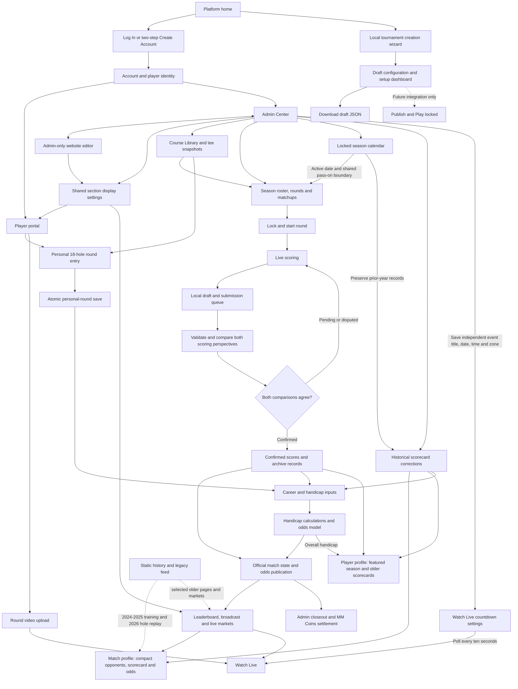

# Maroon Tournament: complete application workflow

Reviewed September 18, 2026 against release `ce85a83`. This describes the current implementation, including older data paths and unfinished features. It is not a promise that everything in earlier design plans is implemented.

Open **app-workflow.html** for the interactive version. Select a workflow box to expand its description, or search for a feature or database table.

## Whole-app flowchart

```mermaid
flowchart TD
  %% Operator recovery tooling only: REST row exports; optional explicit pg_dump to local dump/manifest; isolated restore drill documented. No provider monitoring, PITR activation or application integration.
  %% Platform home uses centered brand/menu/account navigation, Log In, Create/Join actions and editorial feed links. Mobile authentication and tournament activity remain unavailable.
  PH[Platform home] --> AU[Log In or two-step Create Account]
  PH --> DW
  AU --> A
  %% Public tournament site kit is fixture-only; local HTML preview in out/tournament-site-preview, no /t route or live data connection.
  %% Contact page email links and prefilled drafts address themaroonadmin@gmail.com.
  %% Join Tournament explains the commissioner-link requirement; it does not enroll a player.
  DW[Local tournament creation wizard] --> DD[Draft configuration and setup dashboard]
  DD --> DJ[Download draft JSON]
  DD -. Future integration only .-> DP[Publish and Play locked]
  %% Journal header: The Maroon left and Tournament site right with edge padding; hero category buttons hold dropdowns on desktop/mobile.
  %% Desktop footer: /website alone shows the sponsor band and cutout; Journal and other public pages keep only the maroon information band.
  %% Home Highlights follows the Home display year: curated 2026 archive results with match links; unpopulated years are blank and do not inherit 2026 entries.
  %% Tournament home hero uses a neutral black readability gradient over desktop video and mobile photo.
  %% Browser tabs use a single dark-maroon M with a thin muted metallic-gold outline on transparent alpha through favicon.ico (16/32/48px) and icon.png (64px), shared by tournament and journal routes.
  %% Public entry: / opens the platform home; editorial stays at /the-maroon; founding tournament Home stays at /website.
  %% The Maroon routes replace tournament chrome with their own maroon header and tournament-site link to /website; a shallow shared photo hero holds schedule-style Home/category navigation.
  %% More places The Maroon photo home link below social links, followed by Courses, Equipment, Teaching and News; public journal pages use existing course/history links and explicit unpublished-section placeholders.
  %% Active follows handoff; the next year becomes Upcoming the day after the active event end date in its time zone; later years are Future. Event countdown follows Upcoming Session 1 / Match 1 saved date and time, independent of home display settings or setup locks.
  %% Public Players directory: Maroon, White, Unassigned and Stats; mobile selectors use compact spacing. Stats merges static profiles, roster identities and public registered names into an alphabetical table with pinned names and twelve scrolling placeholder columns contained within the viewport.
  %% Home Teams year pill uses the Match Play expanding selector: inline year choices, collapse on selection or outside click, scrolling for longer year lists.
  %% Home Teams year pill selects archived 2024-2026 rosters or confirmed native assignments; ten-second refresh restores team-specific TBD slots up to six per side except the four-player 2024-2025 archives. Names face the center; blank MM Hcp, Sc. Avg., and TPE columns mirror outward without grid lines.
  %% Page and major section titles share the official Spectral Bold Maroon Tournament title font.
  %% Home-screen bookmarks use the supplied metallic gold artwork with a maroon left M and white right M; Apple icon metadata and Android manifest supply resized PNG assets.
  %% Optional password-status migration derives player_slots.password_created from the linked Auth password credential; deployment pending.
  %% Verified password setup displays the account username and authentication email above the password field.
  %% Invite URL fragments are exchanged for session cookies before password entry; recovery codes use the server callback. Invalid links offer a fresh reset.
  %% Course photo imports support nested photo folders and replacement/removal of Main labels; Palmer and Pete Dye assets are imported.
  %% Accordion date/session labels are explicitly positioned below the top overlay and remain horizontal in every panel.
  %% Schedule landing and accordion are fixed edge-to-edge viewports; Photo Library shows non-main imported images for the active course.
  %% Schedule landing at /schedule uses the supplied Mission Hills photo and four January 6-9 links into an eight-session photo accordion with all eight desktop strips visible and the active panel at 50% width. The 2026 data source stays live until its calendar pass-on.
  %% Season timing overview match boxes show both sides' player names, armed/live/archive badges, and hover/tap workflow timing from live Admin-created match boxes or checked-in historical matchup data.
  %% Session course setup keeps one base rating/slope tee and stores per-hole played tee names/yardages for live scoring display.
  A[Account and player identity] --> P[Player portal]
  A --> T[Admin Center]
  %% Admin Center renders the season timing overview last, after year-specific setup and global tools.
  T <--> WE[Admin-only website editor]
  WE --> WS[Shared section display settings]
  T --> WS
  WS --> P
  WS --> B
  T --> C[Course Library and tee snapshots]
  T --> S[Season roster, rounds and matchups]
  T --> Y[Locked season calendar]
  Y -- Active date and shared pass-on boundary --> S
  Y -- Preserve prior-year records --> X
  %% Session count has its own persisted lock; locked selected counts are green and require unlocking before changes.
  C --> S
  %% Sessions may lock partially; chosen locked fields publish to schedule, while destination indicators explain separate matchup, time and broadcast gates.
  S --> R[Lock and start round]
  R --> L[Live scoring]
  %% Scoring screen imports browser-safe matchup labels; Supabase session loading remains on the server.
  L --> D[Local draft and submission queue]
  D --> V[Validate and compare both scoring perspectives]
  V --> Q{Both comparisons agree?}
  Q -- Pending or disputed --> L
  Q -- Confirmed --> H[Confirmed scores and archive records]
  H --> O[Official match state and odds publication]
  H --> K[Career and handicap inputs]
  H --> PP[Player profile: featured season and older scorecards]
  X --> MP
  X --> PP
  %% Fourball scorecards separate best-ball/status/best-ball into a gold-outlined middle block; mobile player rows retain team colors.
  %% Mobile scorecard is edge-to-edge with 44px rows and a narrower total; player panels use team colors and status replaces tee time after play starts.
  %% Player links preserve the source match for Back navigation; slider endpoint thumbs remain fully visible and graph footer copy is visually hidden.
  %% Match Odds card remains before, during and after play; scheduled matches show a probability ring, live/final matches show the existing hole graph.
  %% Probability graphs label completed-hole slider positions, with gold ticks over the numbers, decided results carried through hole 18, and Final scorecard cells in the winning team color.
  %% Desktop match pages fit all 20 columns and align the odds graph; mobile uses fixed-side nine-hole swipe pages and a full-width 18-hole graph.
  O --> B[Leaderboard, broadcast and live markets]
  %% Desktop leaderboard match lists are centered at 40vw with taller rows; ticker width and mobile layout are unchanged.
  B --> MP[Match profile: compact opponents, scorecard and odds]
  %% Match Back links return to the match day; leaderboard day selection lives in the URL for browser Back and reloads.
  Z -. 2024-2025 training and 2026 hole replay .-> MP
  O --> F[Admin closeout and MM Coins settlement]
  %% My Handicap score list shows only the order dropdown followed by scores; explanatory paragraphs are removed.
  %% White-team portal navigation area has a maroon backdrop behind Submit a score and the four navigation rows.
  %% Portal Profile, Career, Round video and Wagers rows use their named supplied photos with white labels, individual gold outlines, and spacing between selections.
  %% Portal hero links stacked 2026/Skins and a large total to the authenticated Skins/Payout page: expandable winning holes with nested opponent scores and separate $200 individual-round pots; 2027 is not connected.
  %% Portal hero contains evenly spaced white serif My Handicap and Player Lookup links near its bottom.
  %% Portal: overall handicap number opens My Handicap; separate Submit a score pill opens the handicap screen.
  %% Player Lookup starts with its selector below navigation; the header back arrow always returns to /portal.
  %% Player Lookup is an authenticated read-only player directory with handicap history and profile-stat comparisons.
  P --> N[Personal 18-hole round entry]
  C --> N
  N --> E[Atomic personal-round save]
  E --> K
  T --> X[Historical scorecard corrections]
  X --> K
  K --> M[Handicap calculations and odds model]
  M --> O
  M -- Overall handicap --> PP
  %% Broadcast ticker: taller, content-sized top five; hidden while the individual leaderboard is visible.
  B --> W[Watch Live]
  T -- Save independent event title, date, time and zone --> BC[Watch Live countdown settings]
  BC -- Poll every ten seconds --> W
  P --> U[Round video upload]
  %% Home hype video plays directly from the public website-media R2 object; no tracked MP4.
  U --> W
  %% Audit 2026-09-21: historical scorecard round IDs and setup round IDs are misaligned; repair pending.
  Z[Static history and legacy feed] -. selected older pages and markets .-> B
```

The branches are related but not interchangeable. A personal round is not a tournament submission. Turning on the broadcast does not start scoring. A submitted hole is not necessarily confirmed. A mathematically completed match is not necessarily administratively closed out.

## 1. Accounts, identity, and permissions

The Log In form uses a centered cream account panel with Email selected and Mobile disabled. Username-or-email login, password visibility, forgot-password and verification resend retain existing behavior. Next submits to the existing login endpoint.

Create Account (`/signup`, including invitation codes) first collects email and password, then the existing required name and username. Next changes steps without sending credentials; Create Account submits the unchanged payload to the existing signup endpoint. Invitation usernames stay fixed, Back preserves entries, and success asks the user to verify their email. These pages use the platform header and no tournament footer. Mobile authentication is explicitly unavailable.

The `supabase/player_slots_password_created.sql` migration adds a read-only-in-practice `password_created` boolean to `player_slots` for inspection in Supabase Table Editor. It backfills existing linked accounts and database triggers maintain the value when passwords or `claimed_by` links change, including unlinking/deletion. True means the linked Auth account has a password credential; false means no linked password credential. No password or hash is copied into player data. It does not prove email verification, successful password login, or a portal visit, and does not change the current Claimed label or access rules. Run the migration in Supabase SQL Editor to enable this feature; live execution has not been verified.

After invitation or recovery verification, the Set Password screen shows “Your username is” with the signed-in profile's username and “Or log in with” with the authenticated account's email above the password field. These details come from the verified session, not link parameters. Accounts without a profile username see only the email login option.

A visitor can browse public pages. Signing up creates a Supabase Auth account and a `profiles` row. A reserved MM username can claim an unclaimed `player_slots` entry, linking that account to a particular golfer. An ordinary fan account does not automatically receive player access.

Admin invitations create a login and linked player profile before the player sets a password. Invite links return session tokens in a browser-only URL fragment. The password form removes that fragment from browser history and posts the tokens to `/api/auth/password-session`, which uses Supabase to establish session cookies. Password-recovery links with a code instead establish cookies in `/auth/callback`. The callback always returns to `/reset-password`. The form verifies the session before enabling Save; expired, incomplete, or failed links show a fresh-password-link option instead of letting the player submit without a session. Recovery links should be requested and opened in the same browser. No email-template or database migration is required for the standard invite flow.

The stable player identifier is a `firstname-lastname` slug, such as `cade-barone`. Display helpers turn it into a first name, last name, or full name. Some historical code still accepts old IDs and first-name aliases. These are compatibility translations, not a safe substitute for identity or permissions.

Player actions use `requirePlayer` to derive the golfer from the authenticated session. Admin actions check the account's `is_host` permission. Hiding a button is not the authorization mechanism: the server checks access again. Supabase row-level policies provide another boundary; the privileged service-role client stays on the server.

**Input:** account credentials, a profile, and an optional linked player slot. **Output:** public browsing, fan account features, player tools, or Admin tools. Login, verification, password reset, and logout belong to this layer.

**Code:** `app/api/auth/signup/route.ts`, `lib/portal/requirePlayer.ts`, `lib/portal/requireHost.ts`, `lib/data/players`.

## 2. Calendar year, active season, and broadcast year

The Admin Center season overview adds a locked website calendar for 2026-2034. Active and Pass on dates share the neighboring boundary and take effect at midnight America/Chicago. Draft dates do not switch the site. Locking both dates arms the window; a locked previous Pass on also protects the next Active field. Server validation serializes neighboring edits and rejects reversed, conflicting or overlapping windows. On pass-on, the successor becomes active, the outgoing year gets an archive timestamp, and existing year-keyed scores, matches, scorecards and odds remain in place. No score is copied, fabricated or closed out by the calendar. An archive timestamp remains after unlocking the dates. The 2026 data source is not treated as archived merely because 2027 is being prepared or selected; it remains live calendar data until its own Pass on date or archive timestamp.

`season_calendar.sql` installs the table and service-role-only save/sync functions. Calendar reads synchronize the stored active year and completion timestamp; if pg_cron is already enabled, an idempotent named minute job also updates it without a visitor. Public rendering is dynamic, and open browser catalogs refresh every ten seconds. The native season catalog feeds the public year tabs, History, leaderboard, teams, schedule, player scorecard routes and main home/navigation cards. Native archive URLs continue reading their original season and confirmed scores after a new year takes over. Career Archive/handicap records already span years and remain intact. Legacy 2024-2025 archives remain their original data sources; 2026 uses its checked-in tournament data as the live source until the calendar archives it. Static editorial text and the legacy Fantasy/Skins products are not converted into new season data. Broadcast follows the locked calendar when armed; manual display-year behavior remains the fallback before a calendar is armed.

2034 remains the existing disposable test season: it is visible in the overview but cannot be armed as a public handoff. A real successor must be added before arming the 2033 pass-on. Manual test activation is preserved for scoring rehearsal. With no effective locked calendar, existing public-year and active-season defaults remain available. Apply the migration before deploying the new calendar controls; live migration and deployment have not been verified.

Player bios fetch `/api/players/[slug]/handicap` without caching. This returns only the overall index calculated by `combinedHandicapIndexes` from the same submitted and archived round sources as My Handicap; static and approved bio handicap text no longer supplies the displayed number.

Player bio redirects follow the locked calendar used by the public leaderboard, with the old January 1 switch as the fallback before arming a calendar. The featured 2026 page shows only earlier years in its lower scorecard archive; a featured 2027 page shows 2024-2026 there, even before any 2027 scores are posted. The upcoming profile reads `/api/live/players/[player]` from the native confirmed snapshot for the public season, independent of the host's active rehearsal year. Career Stats adds that public season's native match boxes at the switchover. Configured native future seasons receive year-specific routes and tournament metadata from the season catalog.

The selected season and the year being edited remain distinct:

| Context | How its year is selected | What it controls |
|---|---|---|
| Player portal My Matches | Public season catalog | Which year's match cards appear |
| Native scoring | Calendar-synchronized `live_active_season`, with manual test override | Which tournament receives real scores |
| Broadcast | Locked season calendar, otherwise `broadcast_display_year` | Which season the broadcast displays |
| Historical website page | Tournament slug in the URL | Which archived edition is shown |
| Admin Master Settings | Year being edited | Which season's setup Admin is viewing/changing |

Merely browsing a different Master Settings year does not switch the active scoring season. Switching the broadcast year does not move scores to another tournament. Starting a round and marking the broadcast live are also different actions.

If the season-calendar sync RPC or calendar table cannot be read, page rendering falls back to the current manual active year from `live_active_season`, or 2027 when that is also unavailable. The website logs the failed sync/read and keeps public navigation, tabs, and static upcoming-season content available. Calendar-controlled archival, scheduled handoff behavior, and locked-window availability remain unavailable until the database function/table can be read again.

For example, in September 2026, My Matches can correctly show 2026 matches as Past while Admin prepares active season 2027 and rehearses an older broadcast. Supported live-season years are currently a configured range; creating future historical website editions is not automatic.

**Code:** `app/portal/page.tsx`, `lib/live/activeSeason.ts`, `lib/live/seasonYears.ts`, `lib/broadcast/displayYear.ts`, `lib/data/index.ts`.

The season timing overview now distinguishes Archived, Active, Upcoming, and Future (with a separate Test season label). Active and archive handoffs retain their configured calendar boundaries. After Active's saved end date has passed in the tournament time zone, the following real year becomes Upcoming; later years are Future. A missing saved end date falls back to the checked-in historical event end date. Thus, while 2026 remains Active, its January 10, 2026 end makes 2027 Upcoming starting January 11; 2028 onward is Future. No test year is promoted to Upcoming.

## 3. Public website and navigation

**Main Page tournament entry.** `/` uses the supplied sketch: menu, centered wordmark, account icon, Log In, Create Tournament, Join Tournament, then Feed. Create opens `/tournaments/new`; the menu and footer link to the implemented `/tournaments` list. Join expands an honest holding state asking for a commissioner-provided link; no enrollment is performed. Feed shows existing Courses and Equipment exploration cards, explicitly not tournament activity. `/the-maroon` retains the editorial landing, `/website` retains the founding tournament, and `/contact` retains its email-draft form.

The Website homepage (`/website`) desktop footer uses the supplied maroon-jacket cutout, cropped from the bottom across the white sponsor band and maroon information band. Content and its white separator occupy the area from 35% to 90% of the viewport. The white band reads ?Thank You to? above ?our sponsors? with both configured sponsor logos to its right; it replaces the newsletter signup prompt. The decorative top stripe is removed. Journal top navigation and the footer use `maroon-900`, matching the Admin Center and tournament secondary navigation. Journal home/category pages and other public routes retain only the maroon wordmark, divider, links, copyright and back-to-top section, with no sponsor band or cutout. The footer remains desktop-only and is absent from portal/broadcast routes.

Home Highlights displays thirteen dated 2026 archive summaries: the 17?16 Cup result, Nate?s individual title, Cam and Drew?s singles records, eight session recaps, and Hugo/Nate?s opening fourball win. Six entries appear initially; More Highlights opens the full season feed. Headlines link to archived matches, the individual winner, or tournament standings. These are curated summaries grounded in checked-in `2026-palm-springs.ts` results, not a live event log or inferred shot chronology. The feed follows the Home tournament/hero display year (explicit selection, then scheduled calendar; before legacy New Year handoff it uses the latest completed season). Switching to 2027 or any unpopulated year renders a blank Highlights panel, resets the expanded feed, and never carries 2026 stories forward. Automatic confirmed-score event generation, shot-video attachments, and Admin pin/edit controls are not implemented by this change.

The tournament homepage hero uses a neutral black gradient over its desktop video and mobile fallback photo to keep overlaid text readable without a maroon tint.

The public root `/` opens the platform home. Its menu links to the existing editorial landing at `/the-maroon` and founding tournament at `/website`. Tournament routes and Admin previews continue to target `/website`.

Browser tabs use a single dark-maroon M with a thin muted metallic-gold outline on a transparent background, with no gold background or white M; the source asset is public/icons/maroon-m.png. `app/favicon.ico` includes 16px, 32px, and 48px versions, and `app/icon.png` provides a 64px Next.js metadata icon. Both tournament and journal pages inherit these icons. The existing Apple and Android home-screen icons retain their earlier gold MM artwork. Cached browser tabs may require reopening after deployment.

**The Maroon journal.** More includes a compact photo card linking to `/` beneath the social links, followed by direct Courses, Equipment, Teaching, and News selectors. The journal replaces tournament chrome on `/` and all `/the-maroon` routes with its own maroon header and a Tournament site link to `/website`. Tournament tabs, countdown, and player-area navigation are absent from this journal shell. Directly beneath its header, a shared shallow course-photo hero contains a white uppercase Home link and Courses/Equipment/Teaching/News dropdown buttons styled after the schedule page, with an underline on the selected category. The header reads The Maroon at the left edge and places the Tournament site link at the right edge, with responsive side padding and no duplicate category menu. Hero dropdowns work on desktop and mobile, include an All-category link to each existing category page, and retain the existing submenu labels and placeholder `#` destinations. Menus close on selection, outside click, or Escape and extend below the hero without clipping. The journal home retains category cards and all four section previews below the hero. Its Home/category navigation persists across `/the-maroon/[category]`; each of the four categories has a dedicated page and unknown categories return 404. Courses links to the existing schedule/course photos and News to tournament history. Equipment and Teaching explicitly show coming-soon placeholders. This is a local editorial section scaffold, not a live article feed, publishing CMS, or imported Golf Digest content. The tournament More drawer scrolls on smaller screens.

The public Players directory adds Stats beside Maroon, White and Unassigned. Stats lists all checked-in profiles plus selected-roster identities and registered players returned by `/api/players/names`, deduplicated by canonical slug and ordered alphabetically by full name. The existing names hook retains static/roster names if the request fails. It follows the individual leaderboard's compact surname rows, mobile maroon header and desktop gold border, with pinned player names and twelve horizontally scrolling Stat 1-12 columns. All values are placeholder dashes, with no rankings or calculated statistics. This applies to the tournament Players directory; the upcoming season's separate confirmed-roster preview remains separate.

The desktop and mobile event countdowns follow Upcoming, or Active when no Upcoming year exists, independently of the home display-year override. They combine Session 1's saved date and first match tee-time slot using the season time zone; if that slot is absent, Match 1's stored tee-time clock value is used with the session date. A complete setup lock is not required. Missing date/time shows Time TBD. Targets refresh every ten seconds and display exact days and HH:MM:SS, stopping at zero.

The home Teams panel starts on the configured home_teams display year. A year pill above the Maroon/White bar offers the checked-in 2024-2026 archived rosters and native years with locked player assignments (excluding test year 2034). The configured year remains available even when empty. The pill uses the shared Match Play selector: clicking expands inline year buttons, selection or an outside click closes them, and longer lists scroll horizontally. Visitor selection stays local to the panel and does not change shared settings. Native rosters read live_roster joined to live_roster_assignment_locks by year and player, refreshing every ten seconds. The 2024 and 2025 archives show their four actual players per team without TBD rows. Other years show at least six slots, with Maroon Player TBD or White Player TBD for vacancies; removing or unlocking an assignment restores its placeholder. Loading and failed requests are identified without presenting an unavailable roster as an empty confirmed one. The borderless roster tables place names nearest the center and mirror MM Hcp (Maroon Tournament handicap), Sc. Avg. (Maroon Tournament scoring average), and TPE (Total points earned) outward, with extra row spacing and outer space reserved for future columns. Hovering, focusing, or clicking/tapping a header reveals its full label above the tables; clicking again or pressing Escape dismisses the selected label. Each team scrolls horizontally on narrow screens from its name column outward. Stat cells are blank placeholders, not connected to scoring or handicap data.

Home-screen bookmarks use the supplied metallic gold artwork: a maroon left M and white right M with raised gold edges on a brushed gold background. The full square image is resized without cropping or redesign. `app/apple-icon.png` supplies Apple's 180px touch icon; `app/manifest.ts` supplies Android/browser 192px and 512px PNG icons from `public/icons`. The manifest retains browser display mode; this change does not add offline support or redesign the installed layout. Device launchers may apply their own masks. Existing saved icons may need to be removed and re-added after deployment.

On live and archived leaderboards, Match Play boards are centered in a 40vw column at desktop widths (1024px and above), capped at the available content width. Desktop match rows add 10px vertical padding per player name instead of mobile's 6px. The ticker, individual standings, and mobile layout retain their existing sizing.

Home, schedule, teams, players, history, tournament leaderboards, match pages, and player scorecards present tournament information publicly. The official title font is Spectral Bold, matching the Maroon Tournament Fantasy heading. Global h1/h2 rules enforce it across page and major section titles, including legacy utility and CSS-module headings; font-title is available for title text outside heading elements. Existing text sizes, colors and capitalization remain as authored. Body text and smaller labels retain their existing fonts. The Schedule tab now opens a photo landing page at `/schedule`, using the supplied Mission Hills image with The Maroon Tournament, Mission Hills Country Club, and Palm Springs, CA text. Day links come from the selected season dates and its saved session dates. They open `/schedule/[slug]?date=YYYY-MM-DD`, an image accordion sized to the saved sessions that initially expands the selected date's first session. Desktop fits the session strips in one screen: the active panel takes 50% of the width and the other strips share the remaining 50%; a single panel uses the full width. Mouse-wheel or trackpad scrolling advances the active session without moving the strip layout offscreen. Mobile aligns the active panel at the top with room for two collapsed panels below, then scrolls vertically. Dates and session labels read horizontally at the top of every strip, explicitly positioned below the fixed controls with white text and a dark shadow for contrast. Clicking a strip or using arrow keys also selects it. Collapsed strips show only date and session; the expanded panel shows course, format, venue, and location. Saved locked round dates/course/format are used where available; missing dates, courses and formats use explicit pending labels without inventing a January schedule. Schedule landing and accordion occupy fixed edge-to-edge viewports over the site chrome, with Back controls to leave. Only the mobile accordion and photo-library dialog scroll internally. The accordion replaces tournament branding with a top-center Photo Library button. Course photos are imported from course folders and their nested photo subfolders using `node scripts/import-course-photos.cjs "path/to/MM-Website"`; source files remain unchanged. Main1, Main2, Main3 images are prioritized in that order across repeated course appearances, cycling if needed; other images populate the course library. A checked-in manifest and optimized public WebP files make imported assets available after deployment; later local folder edits require another import. Optional trailing folder names limit the import to named courses. Re-importing a course replaces its Main/library assignments, including when no Main labels remain; then all remaining photos are library photos and the accordion uses its fallback main image. Renamed Photos-suffix entries are consolidated, and content-hashed output URLs refresh changed images without stale browser-cache reuse. Palmer and Pete Dye each currently have two main and four library images. Course names match normalized folder names, with a unique contained-name fallback ignoring a Photos suffix. Unmatched courses retain the Mission Hills fallback and an empty-library message. The unfiltered `/schedule/[slug]` venue pages remain available. Historical editions and much descriptive content originate in committed `lib/data` files. Upcoming venue/dates, round courses/formats, and confirmed roster receive Admin-managed database overlays where the relevant loaders are used.

The Website / Portal / Scoring selector changes the destination, not the account or database. The More menu contains secondary destinations. Public teams can show locked roster assignments rather than exposing every draft assignment as confirmed.

Historical pages use their own edition's definitions. The current registry explicitly lists 2024-2026 as past tournaments and 2027 as next. Recording future live scores does not by itself create a fully populated new historical website edition.

Some pages are statically generated or cached; others render dynamically or refetch in the browser. A changed database row therefore does not imply that every number on every page refreshes in exactly the same way.

The live leaderboard specifically polls native matches and standings every ten seconds, while also retaining the legacy live-feed loader. Available native matches/standings override that presentation; otherwise feed or historical fallback content can remain. The upcoming tournament's leaderboard route also has a calendar switchover check that can redirect visitors to the latest completed edition before the new season.

Selecting a match in the leaderboard opens its own match profile at `/leaderboard/[slug]/matches/[matchId]`, replacing the historical dropdown and enabling navigation for native live matches. Small Maroon and White header boxes sit above inward-aligned player names (Maroon right-aligned, White left-aligned), retaining profile links. The center displays the Central-time tee time before play, match status and Thru during play, and the final result plus Final afterward. Unknown tee times show TBD. The scorecard follows, then a spaced Match Odds card, then a separate Win Probability card. The white, rounded cards use a compact sportsbook layout on mobile and expand to the available desktop width. Match Odds remains visible before, during and after play; time/status shares the market-header row, Open is unboxed, and Spread/Total/ML have inset outlined cells. Scheduled matches show a circular pre-match display using the latest saved state_thru=0 snapshot, with Maroon and White percentages and a separately identified gold tie segment. Without valid pre-match probabilities, a neutral ring and unavailable message appear instead of invented percentages. Live and final matches continue using the existing hole-by-hole graph and slider. The board is edge-to-edge on mobile and shows tee time (TBD if unknown), Final with the result for completed matches, or Thru for live matches. Maroon and White player rows sit beside Open (opening spread and moneyline), current Spread, Total (over/under birdies across the match), and Moneyline columns. These new market cells are display-only placeholders with no pricing calls or bet actions; Open is reserved for the original opening line, not a later live update. Historical pages read the editable archive by canonical tournament round and use the same basic match table as native profiles, with course name, yardages, par, individual strokes, team rows, running status and published final result: on desktop (1024px and above), a fixed-width, non-scrolling 20-column table (compact row labels, 18 holes, and total). Hole and total columns share the available width equally. The shorter probability graph starts at hole 1 and ends after hole 18, leaving the total column outside the plot; each saved odds update uses its completed-hole boundary, with the latest update retained per hole. Maroon/Tie/White labels occupy the row-label column. The desktop graph shows horizontal guides only, with 0% at the center, 50% midway toward either team, and 100% at either edge. Team labels use translucent colored boxes. An early final win fills the remaining holes on the winning half with a gold-outlined result block (for example, 4&3 after hole 15), covering the horizontal guides there. It uses a thin line, stronger team fills, and no estimated-replay heading. The x-axis labels holes 1-18 at the right edge of each hole column, aligned with the completed-hole slider stops; gold tick marks sit directly above each number. Small marks on the probability line are removed. The slider shares the full 0-18 completed-hole scale with the plot: before play is the left edge, after hole 1 sits directly under label 1 at the boundary between scorecard holes 1 and 2, and after hole 18 is the right edge. Thumb centers align with those boundaries on desktop and mobile, including sparse histories and early finishes. Selecting a hole without a saved snapshot shows no saved odds and blank prices, except that a confirmed final winner carries 100% win probability and 0% for tie and the opponent through hole 18. Those decided points show no betting prices. The graph has one larger black Win Probability heading, without the old Match odds subtitle, and its Maroon/Tie/White summary sits nearby on the left. The board and graph have extra spacing below the scorecard. The Maroon team-name box sits above the upper 100%; the White box below the lower 100% uses white lettering and border over an off-white fill, with a text shadow for legibility. Wins on hole 18 show an unboxed result (such as 1 Up) at the graph's right edge on the winning half. The scorecard status shows Final in the winning team color from the deciding hole through the remaining holes, using the published final winner when available. The far-right total status cell shows the final result (for example 4&3 or 1 Up) in the winner color rather than just Final. Hole, Yards and Par rows are 24px on desktop and 44px on mobile, matching the other mobile rows. The mobile scorecard reaches both viewport edges; its row-label column stays 56px and its total column is 36px, giving more width to the nine visible hole columns on each swipe page. Mobile graph team boxes are slightly smaller and inset from the left edge. The top player panels use maroon fill/white text for Maroon and white fill/maroon text for White. Both the top status and Match Odds header show tee time only before play, only Thru during play, and Final plus the result afterward. The gray graph footer is visually hidden, including its selected-hole summary and explanation; screen readers retain these details and historical estimate provenance. Slider thumbs remain fully visible and draggable at holes 0 and 18. Match and player navigation links say Back. Player links from a match carry a fromMatch query parameter so both historical and native-live player pages return to that match; direct player visits fall back to the tournament leaderboard. Below 1024px, match scorecards use the individual scorecard styling: maroon hole headers, cream score cells and score markers, 56px fixed labels and a 36px total, and two horizontally snapping pages for holes 1-9 and 10-18. All player/team/status rows swipe together. Fourball keeps rows 1-5 (course information and Maroon players), then a separated gold-outlined middle block of Maroon Best Ball, Status, and White Best Ball (rows 6-8), followed by White players (rows 9-10). The separation and outline appear on desktop and across the mobile fixed labels, scrolling holes, and totals. Mobile player and best-ball rows use the same team fills and contrasting score-marker colors as desktop: Maroon fill with white lettering and White fill with maroon lettering. Other formats retain their existing row grouping. Immediately below, the 140px-tall probability plot shows all 18 holes without scrolling, with a 52px left gutter for team and percentage labels. It shares desktop horizontal guides, percentages, team boxes and early-win blocks, with compact labels in the left gutter and odds details above; it does not track the scorecard scroll. Individual player scorecards retain their own layout.

Native match profiles poll `/api/live/matches/[id]?profile=1` every five seconds after each response. The profile payload contains that match's confirmed strokes, course holes, official state, and up to 1,000 recent saved odds updates in chronological order. Unplayed scores remain blank; match status stops at the first gap or mathematical win. Fourball displays individual and best-ball rows; Foursome displays shared side scores. The graph uses a single balance line: Maroon win probability plus half the tie probability. The top is 100% Maroon, the bottom 100% White, and the center represents equal team chances or a certain tie. The separate Maroon, tie, and White probabilities and American prices remain above it; a slider explores updates. Native headers retain the latest odds while historical replay headers follow the selected hole. Failed live refreshes retain the last successful display and show an error. Legacy feed-only match IDs have no native profile data and show an unavailable message.

2026 match pages also provide explicitly labeled estimated replays, computed deterministically from the combined, corrected career archive in `lib/odds/historicalMatchOdds.ts`. Only 2024 and 2025 Singles/Fourball individual scores (excluding nine-hole rounds) train individual strength; Alternate Shot uses prior shared-ball scores, broadening from exact partnerships to partner history when needed. Same-par empirical distributions approximate future holes; missing player history uses the prior field pool. Fourball uses best-ball distributions. This simplified model differs from the live Monte Carlo model and writes no prices or bets. The 2026 hole scores reveal match progress only, never train strength. All replay inputs use the canonical tournament round, after normalizing original workbook numbering at its import boundary. The last point uses the published result, and discrepancies or missing history receive a note. Other historical years still have no odds graph unless recorded data becomes available.

**Reads:** committed tournament/player content plus selected live database overlays. **Writes:** generally none from browsing. **Code:** `app/page.tsx`, `app/leaderboard`, `app/teams`, `app/schedule`, `lib/data/activeSeasonOverlay.ts`.

The portal hero contains two evenly spaced white text links near its bottom: My Handicap retains `/portal/handicap` and Player Lookup opens `/portal/player-lookup`. Both use the bold uppercase serif treatment from the Maroon Tournament Fantasy heading, with no filled button backgrounds or borders. Lookup starts directly with the player dropdown below navigation, without a separate page heading or Back link; the navigation back arrow returns to `/portal` on mobile and desktop. Lookup requires a player session, validates the requested player against the static-plus-slot directory, and passes only names/slugs (not slot contact/account metadata) to the client. It displays Maroon Tournament handicap left and combined Overall handicap right, using the same archive and submitted-round calculations as My Handicap. Maroon Tournament and 20 Most Recent are defaults; Overall, All Scores, Highest to Lowest, and Lowest to Highest reuse the existing history logic. Lookup score views are read-only: no submit action or draft card is rendered. Statistics reuses the profile career-archive statistics categories/year controls and comparison picker, defaulting to the signed-in player when viewing another player. Missing statistics and load failures show explicit states.

The Player Portal navigation rows for Profile, Career, Round video, and Wagers use the corresponding supplied photos from `Player Portal/Profile.Career.etc`, imported as optimized WebP assets in `public/portal/navigation`. Each photo fills a separate rounded row with a gold outline and 12px spacing between selections, with white text and a dark overlay; link destinations and permissions are unchanged.

## 4. Player portal and My Matches

After login, a host goes to Admin Center. A linked player receives a hero, team label, handicap, match cards, and links to Profile, Career, Round Video, and Wagers. A fan account does not get player-only tools.

My Matches opens on Live after reopening. Live / Upcoming / Past filter cards for the portal's calendar year. For an already completed registered year, historical match definitions and archived scorecards construct those cards. Otherwise, the portal reads native rounds and match boxes. An empty Live tab can be correct even when Past contains matches.

Opening actual scoring requires a scoreable assigned match in the active scoring season. A displayed historical match is not an invitation to resubmit that old tournament through live scoring.

The portal hero stacks **2026** above **Skins** to the left of a total as tall as both labels, directly below the overall handicap. The entire skins summary links to `/portal/skins`. `lib/skins/data.ts` reads the complete paginated 2026 `archived_scorecard_rounds` and `archived_scorecard_holes` on the server, so historical corrections are reflected on the next page load. `lib/skins/calculate.ts` compares gross strokes across all individual scorecards for the same session and canonical course, hole by hole. A sole lowest score earns one skin; a tied low earns none, with no carryover or handicap adjustment. Singles and individual-ball Fourball count; shared-ball formats do not. A hole is skipped if any participating card lacks a valid positive integer score; single-player fields and duplicate player cards cannot award skins. Players with cards but no wins show zero; absent cards or load errors show a dash. The display is explicitly fixed to 2026. Confirmed live 2027 data is not connected yet; personal handicap rounds do not contribute.

The player-only `/portal/skins` page uses the Fantasy heading and underline-navigation style with **Skins** and **Payout** destinations. The leaderboard sorts by total skins descending (names break ties), with Player name, Total skins, and $ Earned columns. Clicking a player expands winning holes directly below that row: Day, Session showing only Morning/Afternoon, canonical Course, Hole, and gross Score with the existing scorecard shape and a word such as Birdie or Par. Day/session labels use the historical tournament session sequence, including shared-ball sessions in its internal numbering. The Payout table also shows only Morning/Afternoon in Session. Selecting a winning-hole row opens a second disclosure immediately below it containing the other players from that exact session/course/hole, excluding the winner. Opponents are sorted alphabetically by full display name starting with first name; first/last initials (for example, DW for Drew Weisser) appear above each gross score with its scorecard shape. All 11 opponents in a full 12-player field occupy equal-width columns, including on mobile. Full names and score labels remain available as accessible names and hover titles. Missing par is labeled explicitly without guessing a shape. Zero-skin players remain listed with an empty-details message. Both totals and details use the same calculation; load failures show an unavailable state.

For 2026, entry is **$100 per player**, and each of the six individual-ball Fourball/Singles sessions (1, 3, 4, 5, 7, 8) has its own **$200 pot**, totaling **$1,200**. `lib/skins/payout.ts` splits each round pot across that round's skins, then sums each player's shares for $ Earned, before their entry fee. Earnings use integer cents with largest-remainder allocation (player slug breaks equal remainders), so a round with winners distributes exactly $200. The Payout view shows entry, pot per round, total pots, and a round-by-round skins/pot/per-skin table. Per-skin values are rounded for display. A round with no skins leaves its pot unawarded; no carryover is implemented. These are calculated earnings, not payment collection, payment-status tracking, or transfers. No database migration is needed, and 2027 remains unconnected.

The portal hero uses the same combined overall handicap calculation and `formatHandicapIndex` display helper as My Handicap. Its larger, number-only link sits at the top right and opens the Overall tab: a calculated -1.4 displays as +1.4, positive indexes display without a sign, and unavailable indexes display a dash. The separate gold-bordered Submit a score pill sits between My Matches and the Profile/Career/Round video/Wagers box, matches that box's width, and opens the handicap screen.

**Reads:** profile, match data, scorecards, personal rounds, and eligible archive rounds. **Code:** `app/portal/page.tsx`, `components/portal/PortalMatches.tsx`, `lib/portal/liveMatchCards.ts`, `lib/portal/archivedMatches.ts`.

## 5. Player profile edits

The editor loads the original player profile, merges approved overrides, and shows pending proposals separately. Submitting a bio change writes a proposal to `player_profile_edits`; it does not immediately replace the published biography.

Admin can approve or deny a proposal and can set an override directly. Approved values are merged by the profile-loading helpers. Only allowed fields can be proposed. A biography or display-name edit does not change score ownership or the canonical player slug.

**Flow:** player proposal → pending edit → Admin decision → approved override → profile display. **Code:** `app/api/portal/profile/route.ts`, `app/api/portal/admin/profile-edits`, `lib/data/players/overrides.ts`.

## 6. Admin Center and tournament preparation

The season timing overview appears last on Admin Center, after year-specific tournament setup and Global Tools.

**Website editing and shared settings.** Admin Center now links to /portal/admin/website-editor and /portal/admin/website-settings. Both server pages and the settings API require the existing is_host permission; this is the project's Admin role, not a separate username check. The editor embeds the actual website at desktop or phone width, lets Admin select a marked home section or a page, and exposes the same WebsiteSettingsPanel used by the settings page. It also embeds existing Admin editors for dates/venue, courses/formats/tee times, roster/teams, matchups, players, archive, scoring, odds, wagers and broadcast. Those editors write their original records and preserve existing locks and publication gates. Done and refresh website reloads the public view. SAMEORIGIN framing allows this site to embed itself while rejecting other origins.

**Independent display years.** website_section_settings.sql adds a service-role-only table keyed by home, home_results, home_schedule, home_teams, leaderboard, teams, schedule and portal. Each stores a 2024-2033 display year or null (Automatic), plus the latest editor and timestamp. Saving a section takes effect immediately; there is no draft or Publish step. The website and both editing surfaces read this one table. Settings panels poll every five seconds and on window focus without discarding unsaved choices. Public catalogs poll every ten seconds; fresh page requests use saved values immediately. Automatic retains the existing calendar/legacy fallback. Manual choices survive calendar handoffs until cleared. Wager pages and their default match feeds explicitly use the operational catalog, while leaderboard reads request their display section. This does not rewrite archives or activate an operational scoring/betting year; 2034 remains excluded from the selectors. Year-specific archive links keep their explicit year.

**Player portal viewing.** A host may select a player in the editor, which opens /portal?previewPlayer=slug. The server verifies the host and validates the slug against the player directory. Non-host accounts cannot use this parameter to view another player. This changes only the rendered dashboard, not the authenticated identity; host previews hide Open live scoring, and ordinary portal match cards show that action only for the active scoring year. Other account actions retain the logged-in identity.

**Coverage and remaining work.** Section-year controls apply to the home tournament/hero, home results, home schedule, home teams, leaderboard, teams/profile catalog, schedule, and player tournament/match dashboard. Native seasons use existing locked/confirmed records; historical years use their original data. Selecting an empty future season does not manufacture results. Existing Admin editors remain the source for tournament and global operational data. This is not yet a universal editor for every piece of text, image or layout: hard-coded home news and curated year-scoped highlights, 2026 Skins, legacy Fantasy, and placeholder pages retain their existing sources. Skins is still explicitly labeled 2026 and is not relabeled by the portal display year. The new database migration must be installed before overrides can be saved; missing-table reads preserve existing display behavior and Admin sees an unavailable message. Deployment is not verified.

A Season timing overview appears above Year-Specific Setup. Every year has visible Active/Pass on date inputs and Save draft/Lock/Unlock controls. Expand a year to see every tournament day, its sessions, and three pair-match or six Singles match boxes with the correct shared tee slots. Each match box shows tee time, Maroon-side player names, White-side player names, and the current workflow state; live years read those names from `live_match_boxes`, while checked-in 2026 data reads them from the historical matchup schedule. Armed matches show their armed state, live matches use a red pulsing Live badge, and final/handed-off matches show Archived. Hovering or pressing a tile opens a timing popover that lists what the tile is armed for, when it goes live or that it is currently live, and when it will archive at season pass-on. Date-less sessions remain in an explicit pending group. Setup locks, matchup locks, selected count locks, start flags and match states are shown separately; green means a saved locked value, not that play has started. Stored venue timezones label tee times. The 2026 overview reads checked-in historical round setups as live calendar data until pass-on, shows its four tournament days and eight sessions, and does not invent missing tee times. The overview reloads saved setup every 15 seconds and on window focus; it does not publish draft session details.

Number of sessions has its own Lock/Unlock button in Courses & Format. The saved per-year `round_count_locked` flag disables the selector, and a chosen locked count turns green. A blank count may also be locked and stays neutral. Unlock before changing the count; API checks and a database trigger prevent locked count changes, including concurrent writes. This does not change individual session locks, existing session rows, or publication timing. Apply `supabase/session_count_lock.sql` before deployment; live database execution is not verified.

Courses & Format allows a session to be locked with any fields still blank. Filled locked date, course, format, tee times and tee setup are green; blank fields stay neutral. Unlock to edit. Selected tee snapshots must still reference available locked library tees. Course setup now separates the base tee from per-hole played tees: the base tee remains the rating/slope source for the session, while each hole can point to another locked tee set for the yardage, par and tee-box name actually played. The same base/per-hole grid stays visible when locked, but becomes read-only. Live scoring reads the saved per-hole tee name and shows `Hole # - Tee`, then yardage, then par in the top scoring header. Public upcoming schedule and course overlays now read only course-locked sessions; missing values remain pending placeholders. The schedule landing page still uses static venue/dates. The adjacent destination list distinguishes active-season schedule publication, assigned-player match cards, scoring after Start Round and each match's venue-local tee time until final, existing career archive rows, the January 1 upcoming-leaderboard switchover, and the current broadcast match-play session. Market availability remains conditional on separate publication and betting rules. Refresh rechecks external state; the scoring clock updates every 30 seconds. A session lock alone does not start scoring or create matchups. Matchup locking still requires a complete course/date/tee setup and all tee times, preventing incomplete sessions from enabling play.

Admin Center separates year-specific tournament operations from global tools. Season setup contains roster, teams, venue/dates, round count, round schedule, formats, tee times, and matchups. Global tools include Course Library, Career Stats, scorecard administration, Odds Model, Wager Types, Broadcast Controls, and the Live Scoring Page Editor.

The preparation sequence is:

1. Select the intended season and confirm which season is active for real scoring.
2. Assign players and teams; lock assignments intended to be published.
3. Configure each round's date, format, course, and tee setup.
4. Create match boxes with the correct players on each side and tee times.
5. Lock the course and matchups.
6. Start the round when play should be enabled.

Singles has one player per side. Fourball and Foursome have two per side. Match/roster validators enforce the relevant assignment rules. These setup steps are separate state changes, not one universal Publish Everything action.

**Writes:** `live_tournament_settings`, `live_roster`, `live_roster_assignment_locks`, `live_round_state`, `live_match_boxes`. **Consumers:** public upcoming schedule/roster, player match discovery, scoring, and tournament calculations.

**Code:** `app/portal/admin/page.tsx`, `app/api/portal/admin/master-settings`, `app/api/portal/admin/rounds`, `app/api/portal/admin/matchboxes`.

## 7. Course Library, tees, and historical snapshots

A library course is a reusable identity with named tee configurations. A tee setup provides hole numbers, pars, yardages, course rating, and slope. Imports help populate these fields. A similar course name does not prove which tee box was played in a past round.

When a round chooses a locked setup, the server resolves the library tee and takes a snapshot. The shared Round & Format source is `round_format_setups`, keyed by season year and round. It currently applies one setup to the whole field for that round; it is not a per-player tee override system.

Future live rounds automatically populate/update live-sourced snapshots when course and matchups are locked before play. After play starts, ordinary library changes do not rewrite historical snapshots. Explicit archive assignments are preserved separately from automatic live setup updates.

Course aliases connect older labels to library identities. Missing tee, date, rating, or slope is not invented. The handicap eligibility code rejects setups with differing hole tee IDs; mixed tees need an appropriate verified composite design. Players using different tees within the same round need an additional override mechanism.

**Flow:** reusable library → selected locked tee → round snapshot → historical display and handicap metadata. **Code:** `lib/data/roundFormatSetups.ts`, `lib/data/courseLibraryMatch.ts`, `supabase/round_format_setups.sql`.

## 8. Starting a round and opening scoring

Admin starts a round after its course and matchups are locked and match boxes exist. `start_live_round_atomic` changes the round and match-box started flags in one transaction. Failure cannot leave only half of that start operation committed.

A started round can still contain matches waiting for tee time. A match becomes scoreable when its start conditions and tee time are satisfied, or Admin explicitly starts that match. Final matches are closed to entry.

The player's scoring entry point finds the lowest relevant locked round containing that player whose match is not final. Without an appropriate live match, it shows the scoring landing state instead of allowing arbitrary score entry.

Starting the round also attempts a broadcast event, but broadcasting and scoring remain independent controls.

**Code:** `app/api/portal/admin/rounds/start/route.ts`, `lib/live/currentRoundForPlayer.ts`, `app/portal/scoring/play/page.tsx`.

## 9. Live hole entry and local drafts

The phone shows hole/par/yards, running totals, the horizontal hole selector, the scorer's score slider, the assigned opposing player's score slider, and applicable personal statistics. Team-colored rows put the scorer's side first. Par-three fairway is N/A. Putts retains the requested 4+ choice.

In Singles/Fourball, a player records their own score and the assigned opposing player's score. Fourball scoring pairs are position-based within the two sides. Putts, fairway, and green refer to the scorer's own ball. Foursome uses shared side scores and omits individual-ball shot statistics.

Changing a control writes a browser draft scoped to player and match. **Next Hole only navigates. Submit Score validates, submits, and advances after a successful response.** Actual strokes are not capped at double par; the slider has 1-20 plus Other score for larger values.

Drafts survive reloads in that browser. They are not cloud backups, and the app still needs server-provided match/setup data to open normally. This is not a fully offline-installed application.

**Code:** `components/portal/ScoringPanel.tsx`, `components/portal/ScorePicker.tsx`, `lib/usePersistentState.ts`, `lib/live/holeSubmission.ts`.

## 10. Submission, agreement, disputes, and retry

An explicit submission is queued locally with a unique request ID and the last saved timestamp. The API derives player identity from the session. The database verifies the match, season, membership, start/lock conditions, scores, and required statistics under a match lock.

The transaction records the scorer's perspective and compares both score values against the opposing perspective. An identical successful retry returns its receipt rather than creating a duplicate. A stale write from another device is rejected for review.

| State | Meaning | Archive effect |
|---|---|---|
| Draft | Changed locally; no explicit submission | None |
| Queued | Submit was requested; delivery is unresolved | Not proof of confirmation |
| Submitted | This perspective was saved; the other may be missing | Unconfirmed holes excluded |
| Confirmed | Both score comparisons agree | Eligible confirmed holes mirrored |
| Disputed | Either comparison disagrees | The pair's archived holes retracted |
| Edited after submission | Local values differ from the saved version | Requires resubmission |

Correcting and resubmitting matching values restores the archive entries. Red marks a discrepancy. Maroon submission styling alone is not proof that both players have confirmed it.

Network/server failures retain the queue and retry while the page is open, on reconnection, or after reopening online. Reviewable client errors stop the queued attempt while retaining the draft. Editing a queued hole cancels that older queued version. Successful saves are acknowledged before background model calculations finish.

**Writes:** `live_hole_submissions`, `live_hole_scores`, `live_submission_receipts`, audit records, and triggered archive updates. Full 18-hole confirmation also updates round-submission tracking. **Code:** `lib/live/useHoleQueue.ts`, `app/api/portal/scoring/hole/route.ts`, `supabase/live_hole_submissions.sql`, `supabase/scoring_reliability.sql`.

## 11. Match results, standings, and published odds

The shared native snapshot paginates every source, including confirmed hole scores, so a full field cannot silently lose scores beyond the database's 1,000-row response limit. Player profiles, native match scorecards, standings, broadcast and publication use this snapshot. Source query failures surface as errors rather than an apparently empty tournament. Upcoming public player profiles no longer use the legacy sheet feed.

Confirmed live scores feed the native tournament snapshot. Singles compares two scores. Fourball uses the best score on each side. Foursome compares the shared side scores. The match calculation processes contiguous completed holes and stops at the first mathematical win; later stroke scores cannot reverse that result.

A completed match awards one team point to its winner, or half a point each for a tie. Own-ball gross and score-to-par statistics are separate calculations. Foursome team scores are excluded from individual stroke-performance samples.

Score changes create durable `live_publication_jobs`. Publication derives `live_match_official_state` and a model-produced `live_match_odds_snapshots` row. They commit together only if the score revision still matches, preventing slower old calculations from overwriting newer results.

The scoring API starts publication after acknowledging the hole. Scoring-state, public match, and standings requests retry unfinished jobs. These retries are activity-driven; this release has no independent scheduled publication worker. Some displays derive directly from confirmed snapshots, while match/odds APIs read stored publication results.

**Code:** `lib/broadcast/liveSnapshot.ts`, `lib/live/scoring.ts`, `lib/live/orchestration.ts`, `lib/live/publishOfficialMatchState.ts`, `lib/live/retryPublication.ts`, `app/api/live`.

## 12. Admin closeout and final settlement

Mathematically complete and administratively closed out are different states. Players may continue actual stroke scoring after the match is decided until Admin closes it. Admin's closeout cards identify complete published matches and refresh periodically.

Closeout recomputes the contiguous confirmed result in the database. It saves final official state, marks the match Final, marks its archive rounds final, records an audit event, and settles that live-match MM Coins market in one transaction.

If settlement fails, the entire closeout rolls back. Retrying a successful closeout does not pay twice. An early finish is allowed once the lead exceeds holes remaining, but no unplayed holes are invented. A partial round does not become a complete handicap round.

This finalizes one match and its associated market. It does not automatically create a historical website edition, settle every unrelated future/prop, or implement a dedicated pickup/concession workflow.

**Code:** `components/portal/admin/MatchCloseoutCards.tsx`, `app/api/portal/admin/matchboxes/closeout/route.ts`, `supabase/scoring_reliability.sql`.

## 13. Personal round submission outside a tournament

**Flow:** Course → Tee/date/time → 18 hole entries → Review → Submit Round.

This shares the live scoring controls but removes the opposing score, live hole selector, and per-hole Submit Score button. Final review is the round-level submission point. It does not require an opponent's agreement or affect tournament match points.

The player enters actual score, putts, fairway, green, and required miss directions. Par-three fairway is not applicable. Missing entries block review/submission instead of silently becoming zero putts or missed shots. Drafts are retained in the browser.

The server validates all holes, resolves the selected library tee itself, computes the total and differential, and snapshots the tee metadata and hole setup. `handicap_rounds` and all `handicap_round_holes` save atomically. An identical retry returns the existing round through its submission ID.

These rounds feed the overall handicap and the combined Career Archive's personal/Other input. That does not mean every older public career summary includes them.

**Code:** `components/portal/handicap`, `lib/handicap/data.ts`, `lib/handicap/validate.ts`, `app/api/portal/handicap/rounds/route.ts`.

## 14. Differentials, handicap selection, and asterisks

The app computes:

`Differential = ((gross score - course rating) × 113) / slope`, rounded to one decimal.

Example: 78 against rating 74.0 and slope 133 produces **3.4**. This describes the implementation, not an official GHIN certification.

Tournament archive eligibility requires 18 individual-ball holes, a date, and verified tee/rating/slope metadata. Foursome and incomplete rounds do not qualify. Future archive readers also exclude did-not-finish entries. A matched course name alone does not establish eligibility.

The overall index combines personal and eligible tournament rounds, orders them newest first, keeps up to 20, selects the lowest differentials using this table, averages them, applies the adjustment, and rounds to one decimal:

| Available rounds | Lowest differentials used | Adjustment |
|---|---:|---:|
| Fewer than 3 | No index | — |
| 3 | 1 | -2.0 |
| 4 | 1 | -1.0 |
| 5 | 1 | 0 |
| 6 | 2 | -1.0 |
| 7-8 | 2 | 0 |
| 9-11 | 3 | 0 |
| 12-14 | 4 | 0 |
| 15-16 | 5 | 0 |
| 17-18 | 6 | 0 |
| 19 | 7 | 0 |
| 20 | 8 | 0 |

The asterisk identifies rounds selected for the displayed overall or MM-only calculation. MM-only excludes personal rounds. Low Index still replays available history and takes the lowest calculated index internally, but is no longer shown on My Handicap. My Handicap displays a negative calculated index as a plus handicap; a differential retains its mathematical sign.

The current math uses raw gross, not a net-double-bogey adjusted gross. It does not implement PCC, official soft/hard caps, exceptional-score adjustment, GHIN synchronization, or a nine-hole expected-score conversion. Its Low Index is an available-history minimum, not a separately maintained official rolling Low Handicap Index.

**Code:** `lib/handicap/whs.ts`, `lib/handicap/archiveIndex.ts`, `lib/handicap/futureRounds.ts`, `lib/handicap/format.ts`, `components/portal/handicap/HandicapHome.tsx`.

## 15. Archives, corrections, and career statistics

**September 22 implementation (database application pending):** Every source now has an explicit round boundary in `lib/data/roundIdentity.ts`. Original Danzante card numbers map to 1/INDI/3/5/6; Palm Springs cards map to 1/3/4/5/7/8. Generated Pinehurst career records omit the Cradle, so workbook rounds 3 onward map one round later; generated Palm Springs rounds 5/6 swap to match the scheduled Fourball/Alternate Shot sessions. Database and native live rows already use canonical IDs and are never renumbered again on read.

Career Stats match boxes link to their match page. Those pages read the same editable individual holes as player profiles; shared Alternate Shot balls come from separate team records. Pinehurst's Cradle match lists its actual four players per side and its best-three-of-four scores across nine holes. The profile archive can display these nine-hole scorecards without adding them to handicap or the odds training pool. The published historical result remains authoritative when source strokes disagree; the 2026 replay labels such discrepancies.

`scripts/repair-historical-archive.ts` exports a full backup, matches source scorecards by ordered hole scores, checks ancillary stats/edits/video dependencies, and generates transaction SQL. The tested plan retains 159 source rounds (47 Pinehurst, 40 Danzante, 72 Palm Springs), removes 40 identical duplicate rows, preserves the surviving hole records and all three video records, and assigns the existing verified round tees/dates. The SQL locks the affected tables, rejects stale exports, retains a private recovery snapshot, verifies the entire resulting dataset, and is idempotent. It must be executed with a database SQL connection; generation and local PostgreSQL verification are not a live repair. The old renumber scripts now stop immediately. The legacy importer exports insert-only SQL with canonical round numbers; it never overwrites existing rounds or edits.

**September 21 audit:** The configured database contains mixed legacy and corrected round identities for 2025/2026. A read-only all-player audit found 56 Danzante individual scorecards for 40 source rounds and 96 Palm Springs scorecards for 72 source rounds. At the time of that audit, the legacy importer could overwrite corrected round keys, while the handicap loader joins setup by year/round and can consequently display the wrong course and exclude valid individual scores as Alternate Shot. The separate Career Archive round namespace also required reconciliation, now implemented at its source boundary. Findings and a repair plan are saved in `docs/historical-handicap-repair-handoff.md`; reproducible evidence is in `docs/historical-handicap-audit.json` and `scripts/audit-historical-handicap.ts`. No database repair or deployment was performed for this investigation.

The archive is a family of sources, not one universal table:

| Source | What it holds |
|---|---|
| Committed tournament files and generated career data | Imported historical editions and model records |
| `archived_scorecard_rounds` / `archived_scorecard_holes` | Editable historical player scorecards |
| `round_format_setups` | Shared course, date, and tee snapshots |
| `career_archive_rounds` / `career_archive_live_holes` | Native live-round metadata and confirmed individual holes |
| `career_archive_team_holes` | Shared-ball team observations |
| `handicap_rounds` / `handicap_round_holes` | Personal submitted rounds |
| Legacy `career_stat_*` tables | Workbook-imported career datasets used by some readers |

Admin's historical scorecard edits save as a transaction. The combined Career Archive replaces an imported individual round with its editable counterpart, including removal of obsolete imported holes. It combines historical, live, and personal inputs while keeping team observations separate. Large archive readers paginate instead of truncating at 1,000 rows.

This combined loader feeds Admin Career Stats, the Odds Model, and live odds publication. Public archived-score/stat APIs also apply historical overrides but use a different composition that does not add personal rounds. Some older career summary tables and archived broadcast summaries still read committed per-year data directly.

Consequently, an edit is not guaranteed to change every historical number everywhere. Database scorecards, combined model inputs, static yearly summaries, and archived broadcasts must be distinguished. A complete single-source conversion of all older presentation surfaces has not been done.

Round & Format metadata supplies course/tee/date information; it is not the table containing every player's scores. Workbook import is an administrative ingestion path, not a spreadsheet consulted during each live submission.

**Code:** `lib/data/combinedCareerArchive.ts`, `lib/data/careerStatsDatabase.ts`, `lib/data/mergeCareerRecords.ts`, `lib/data/archivedScorecards.ts`, `components/stats/PlayerCareerPage.tsx`, `lib/broadcast/leaderboardData.ts`.

## 16. Odds model and simulator

The simulator combines scoring history with the target course's holes, format, sides, completed holes, and current lead. It samples historical scores by hole characteristics, applies round-shape/format calibration, and simulates possible remaining outcomes.

Singles models two players. Fourball models four players and uses each side's best score. Foursome uses player histories with shared-team/pair calibration. Outputs are Maroon-win, tie, and White-win probabilities, converted to fair American odds without an added sportsbook margin.

Live publication calls the same model family and stores a snapshot. Admin's simulator is an inspection/hypothetical calculation tool; changing its inputs does not submit real scores or settle bets. Missing setup or insufficient samples can produce no model result.

Model eligibility differs from handicap eligibility. Personal Stroke Play requires a complete 18-hole round. Singles/Fourball and confirmed live holes follow their own filters. The current filter excludes records whose `roundHoles` equals nine, including a live round exactly nine holes through. This deserves review rather than assuming every partial live round always enters the model.

**Code:** `lib/odds/preRoundSingles.ts`, `lib/live/publishMatchOdds.ts`, `app/portal/admin/odds-model/page.tsx`.

## 17. Wagers, MM Coins, and the portfolio

An authenticated account chooses a market, selection, and stake. It need not be linked to a player. The server resolves the selection and offered odds rather than accepting arbitrary browser-supplied odds.

Native live-match markets read official match state and the latest odds snapshot. Markets marked complete or closed_out are rejected. The betting RPC records selection, odds, stake, potential payout, and pending status while changing the account balance. Portfolio and coin leaderboard read those bet/account records.

Admin closeout settles the associated live-match market: winning pending bets receive their stored payout, losing bets become lost, and `wagers_market_settlements` prevents duplicate settlement. Other markets have their own settlement path; one match closeout does not settle every tournament future.

Market sources are still mixed. The bet route first checks the legacy-feed market catalog before its native live-match fallback. Wager Types defines/publishes rulebooks, but several items are explicitly `in_design`. A named card or published definition does not prove its calculation and settlement are implemented.

The verified functioning currency path is MM Coins. This map does not describe a real-money deposit, withdrawal, or payment-processing service. Older/mock market presentations are not universally driven by the new stored live odds.

**Code:** `app/api/wagers/mm-coins/bet/route.ts`, `lib/wagers/marketKeys.ts`, `lib/wagers/liveMatchMarket.ts`, `lib/wagers/publicWagerCatalog.ts`, `supabase/schema.sql`.

## 18. Broadcast engine and producer controls

Broadcast Controls includes a separate Watch Live countdown form with a typed event name, date, time, and time-zone selector. Save publishes directly to the holding screen even during rehearsal; it does not start the broadcast. Host-only POST `/api/portal/admin/broadcast/countdown` validates input and saves a global singleton in `broadcast_countdown`, independent of the broadcast data year and tournament tee times. `supabase/broadcast_countdown.sql` creates the service-role-only table; migration application and deployment are not verified. Read/save failures are reported in the form.

The bottom-left leaderboard ticker shows the top five in a content-sized strip capped at the viewport width. It is at least 112px tall (roughly twice its previous height), with larger vertically centered names, placements and scores; text scales down together when space is limited. It hides while the individual leaderboard is visible and returns for holding, match play, player videos, transitions and full-screen event takeovers.

Admin controls display year, auto/producer mode, scene timing, pause state, announcements, playlist behavior, and tournament-live presentation. `broadcast_state` and `broadcast_config` hold these controls. The normal broadcast follows its configured display year; host previews support separate rehearsal inputs.

The scene layer displays holding content, individual leaderboard, and match play, with supported event overlays/takeovers and queued player-video transitions. Live data refreshes through Supabase Realtime notifications followed by API refetches, with visibility/reconnect recovery. Archived-year scenes use historical data sources.

The event queue selects active, unexpired rows using effective priority and age. An event type existing in the library does not prove every scoring path emits it. The atomic hole endpoint publishes official state/odds but does not directly call `publishBroadcastEvent` for every score. Standings may update without every potential celebratory event firing.

Broadcast consumes tournament data. Changing its year, scene, or live flag does not submit scores, start a tournament round, or change handicap calculations.

**Code:** `lib/broadcast/state.ts`, `lib/broadcast/queue.ts`, `lib/broadcast/useLiveBroadcastData.ts`, `components/broadcast/BroadcastStage.tsx`, `app/portal/admin/broadcast-controls`.

## 19. Watch Live, comments, and highlights

Separately, the home Silver Springs hype tile opens `/videos/hype-1`. Its native video player loads `MM Edit - Silver Springs.mp4` directly from the public `website-media` R2 bucket at `https://pub-6a86d18bc79d43b99b2c02fa816169dc.r2.dev/MM%20Edit%20-%20Silver%20Springs.mp4`. The thumbnail remains bundled with the website; the MP4 is not tracked in Git. This uses the public development endpoint, not a production custom media domain.

Watch Live is the public viewing page. If a YouTube live video ID is configured, it embeds that video. Otherwise, when Admin marks the broadcast live, it displays the app's custom broadcast. Before that it shows countdown/holding content.

The holding screen polls its independent countdown settings every ten seconds. Its title is the saved event name, and its displayed date/time and days/hours/minutes/seconds countdown use the same saved target and time zone. No configured event shows Watch Live, Time TBD, and a date/time-to-be-announced label. Elapsed targets stop at zero without automatically going live. The existing YouTube/custom-player selection remains unchanged. `/api/countdown` serves either this event or the separate home tournament countdown and retains no shared browser cache.

The viewer follows broadcast-state and playlist changes. The custom output consists primarily of tournament graphics and queued media; it is not itself a complete camera-stream ingestion/production service.

Watch Live Comments and Highlights are currently placeholder panels: they display explanatory text, not a functioning realtime chat backend or automatically generated highlight collection. They must be distinguished from the functioning broadcast-state and video presentation paths.

**Code:** `app/watch-live/page.tsx`, `components/watch-live/WatchLiveExperience.tsx`, `components/watch-live/BroadcastPlayer.tsx`.

## 20. Round videos and stored media

A player can attach shot video to their own eligible archived scorecard; Admin can manage others. An authorized request obtains a signed upload URL, and the browser uploads bytes directly to Cloudflare R2. A confirmation request then validates the player/round/hole/shot and saves the storage-object link in Supabase.

The scorecard can display the linked video, and the confirmation path can queue it for the broadcast. Video bytes live in object storage; ownership and scorecard references live in the database. Uploading video does not change strokes, resolve a scoring dispute, or create a missing historical round.

The current linking route specifically looks for `archived_scorecard_rounds`. Do not assume that every future native live archive round automatically supports the same upload path. Playlist audio and video presentation metadata are separate from tournament results.

**Code:** `app/api/portal/admin/scorecards/video/sign/route.ts`, `app/api/portal/admin/scorecards/video/confirm/route.ts`, `lib/r2/client.ts`, `lib/broadcast/playerVideoQueue.ts`.

## 21. Live Scoring Page Editor and test season

The editor displays two connected sample phones, Maroon and White. Submitting both demonstrates agreement, disagreement, correction/resubmission, team styling, and the compact mobile layout. Desktop places them side by side; mobile stacks them.

It uses local sample state and shared scoring components. It does not call the real live-hole API or save real scores. It is a visual rehearsal surface, not a general drag-and-drop layout editor; layout changes still require code.

The separate test-season controls operate on a designated database season. This is different from local preview. Test data is excluded from normal combined archive/model reads unless the relevant loader explicitly opts into test data. Resetting the test season is a host action.

**Code:** `components/portal/admin/LiveScoringPreview.tsx`, `components/portal/admin/ScoringPreviewPhone.tsx`, `components/portal/admin/TestSeasonPanel.tsx`, `lib/live/testSeason.ts`.

## 22. Legacy integrations and unfinished pages

**Public Tournament Site UI kit (local presentation only):** `components/platform/tournament-site/` provides branded Home, Leaderboard, Matches, Schedule, Players, Teams, Courses and Results concepts from typed fixtures. Run `npx tsx scripts/preview-tournament-site.tsx` to generate the explicitly fictional `out/tournament-site-preview/index.html`; no application route is added and `/t/[tournament]/[year]` is not wired. Texas Cup and Coastal Open are demonstration data only. Dynamic theme colors, arbitrary teams, individual events, public-handicap display, final labels, empty/locked/coming-soon states and optional image placeholders are supported. No dashboard, persistence, readiness, authorization, scoring or database integration is added. Existing overview boxes and workflow paths remain unchanged.

Current native scoring uses the Supabase transaction path. The repository still contains the older `PlayerScoringPanel`, `/api/portal/score` routes, `LIVE_FEED_URL` integration, and Python API client. The old panel is not mounted by the current app routes found in this review, but some external-feed consumers and endpoints remain.

The obsolete native stroke/stat autosave endpoints reject requests, preventing them from bypassing complete-hole submission. That does not mean all older external integrations have been removed.

Fantasy, Merchandise, Vault, Settings, My Team, and Sponsorship currently render Coming Soon. GPS shows a notice rather than distances. Dedicated pickups/concessions are not a complete workflow. A destination, schema field, or old design document is not proof of a complete connected feature.

**Code:** `components/portal/PlayerScoringPanel.tsx`, `app/api/portal/score`, `lib/scorekeeper`, `lib/data/fetchLiveTournament.ts`, `components/portal/HoleActionBar.tsx`, the corresponding placeholder page files.

## 23. Hosting, storage, and release workflow

Operator recovery is documented in [Backup & Recovery](../BACKUP_RECOVERY_SPEC.md) and [the isolated restore drill](restore-drill.md). Existing `backup:production` exports REST-visible rows without a database-wide snapshot. The optional `backup:database` command requires an explicit production connection environment variable and compatible `pg_dump`, writing a custom-format dump and checksum manifest locally. It has not been run against production. Provider backups/PITR, Auth recovery and independent media copies remain unverified; secrets require separate protected recovery. The backup-health model uses fixtures only, with no admin UI or provider connection. No automated restore or retention deletion exists.

| Component | Responsibility |
|---|---|
| Browser | Interface, local drafts, retry queue, some preferences |
| Vercel / Next.js | Website rendering and API routes |
| Supabase Auth | Sessions and account authentication |
| Supabase PostgreSQL | Scores, setups, archives, profiles, wagers, transactions |
| Supabase Realtime | Change notifications that trigger refetching |
| Cloudflare R2 | Uploaded media files |
| GitHub | Code, migration files, committed historical data |

Database migrations and website deployments are separate. Deploying code does not automatically run the SQL files. For a required additive migration: test code/SQL → apply migration → verify functions → deploy matching code → verify production domain assignment → smoke-test live endpoints.

Vercel Preview and Production have separate environment-variable scopes. The earlier preview failed for missing Supabase settings; production succeeded with its configured settings. A staged Ready build does not necessarily mean the live domain points at it.

**Code:** `package.json`, `lib/supabase`, `lib/r2`, `supabase/*.sql`, `docs/scoring-reliability-release.md`.

## 24. One hole, end to end

1. Admin locks the round's setup and matchups, starts the round, and its tee-time/start conditions open scoring.
2. Cade records his score, the assigned opponent's score, and his own statistics. These are browser drafts until Submit.
3. Submit sends a uniquely identified request. The server validates and commits the saved perspective.
4. If the opponent is missing, it waits. If either score comparison disagrees, the pair remains disputed and is excluded/retracted from the confirmed archive.
5. Matching submissions confirm the holes. The phone receives acknowledgment; background publication updates official state and odds. Live consumers refresh their appropriate data.
6. If the match is mathematically won, that result stops changing. Players may record further actual strokes until Admin closes the match.
7. Admin closeout atomically finalizes the match and settles its MM Coins market.
8. If the individual round has all 18 eligible holes and verified tee/date data, it can contribute a handicap differential. A partial or shared-ball round cannot become a complete individual handicap round.

## 25. Tournament draft wizard and setup dashboard

The standalone `/tournaments/new` page implements CREATE → EXIST → COMPLETE as a local UI preview. Eight steps cover Basics, Competition Type, Player Count, Structure, Scoring Style, Round Formats, Optional Branding, and Review & Create. Creation requires the name, dates (up to 14 days), timezone, privacy preference, competition type, expected player count (2–64), number of rounds (1–20), scoring style or TBD, and distinct team names for team events (2–8 teams). Individual events never require teams. Short name and a provisional slug are derived from the tournament name; no URL is reserved.

`lib/platform/tournamentDraft.ts` reuses types from `tournamentConfig.ts` and the existing format registry without changing the full readiness validator. Drafts explicitly allow null formats, scoring choices, detailed rules, round days and branding. Player count is planning metadata, not fabricated roster entries. The current registry only offers match formats and the current scoring model only supports two-team match play, so individual events retain TBD formats and scoring; events with more than two teams retain TBD scoring. Full configuration validation remains a later publish/play gate.

After creation the same page shows Tournament Setup — X% Complete, with Basics, Players, Teams, Courses, Rounds, Schedule, Rules, Branding, Website, Media, and Publish cards. Statuses are Complete, Needs Attention, Optional, Not Started, and Locked. The percentage counts completed required setup sections; optional branding/media, individual-event teams, and locked Website/Publish are excluded. Rounds means planned count and formats; course and schedule completion are tracked separately. Named teams still need roster assignments; selecting match play does not complete detailed rules.

Basics, teams, formats, scoring and branding can be reopened in the wizard. Review confirms edits; cancel restores the last created draft. The remaining setup tools are explicit future placeholders. Publish, website creation and live play are unavailable. Privacy is a future publishing preference, not an access-control operation in this preview. Destination, description, logos, team colors, player details, courses, tee times, pairings, detailed rules, media, sponsors and broadcast options are optional at creation.

Drafts stay only in React component state and disappear on leaving or refreshing. View configuration and Download draft JSON expose the clean versioned draft object; there is no import, API mutation, database persistence, auth/role change, edition resolution, schema migration or live-scoring connection. The surrounding existing app layout is unchanged. Implemented locally; deployment has not been verified.

## Review findings

This map identifies remaining distinctions worth reviewing: static versus corrected career summaries; independent year controls; model exclusion at exactly nine holes; incomplete event emission wiring; legacy market/feed consumers; future live-video/archive-edition transitions; and unfinished GPS, placeholders, pickups, and official full-handicap features.

These are observations from the documentation review. No application behavior was changed while creating this map.

## What changed

**2026-09-30 ? Platform home and account flow (implemented locally; deployment not verified).** Replaced the root editorial hero with the supplied home hierarchy and a centered platform header. Log In and Create Account now use matching cream panels; signup collects the same required fields across two steps. Mobile authentication, Join enrollment and tournament activity are explicitly unavailable. Existing auth endpoints, invitation codes, verification and founding tournament behavior are retained. Updated sections 1 and 3, the Mermaid flow and rendered navigation mapping.

**September 30, 2026 - Backup and recovery operations (implemented locally; deployment and production recovery not verified).** Previously the operational guide relied on REST row exports and provider backup checks. Added a separate explicit PostgreSQL dump command with timestamped manifests/checksums, fixture-only backup-health model, coverage audit, planning objectives and isolated restore-drill instructions. Updated section 23, the flowchart annotation and high-risk migration prerequisites. No application workflow paths or overview boxes changed; renderer mapping remains unchanged. Provider scheduling, PITR and production restore are not implemented by this work.

**2026-09-30 - Gold-outline login controls (presentation implemented locally; deployment not verified).** The login fields and button previously had white fills and mixed font families. They now have transparent backgrounds, gold borders, white text, and the shared Spectral font throughout the login form. Removed the account prompt, leaving a left-aligned Sign Up link. Updated section 1 and Mermaid annotation; authentication behavior and overview mappings are unchanged.

**2026-09-30 - Maroon account panel and fixed mobile layout (presentation implemented locally; deployment not verified).** Removed the extra wordmark, renamed Sign In to Log In, and replaced the white panel with maroon, white text/fields, and a square gold border. Narrowed the form content by about 20% and shifted it toward the desktop photo. Mobile now hides the photo and fills the available viewport beneath navigation, with internal scrolling when necessary. Updated section 1 and Mermaid annotation; authentication behavior and overview mappings are unchanged.

**2026-09-30 - Split account form layout (presentation implemented locally; deployment not verified).** Sign In and Sign Up previously appeared as narrow centered forms under tournament navigation. They now use Main Page navigation and a white left form panel with The Maroon branding, visible field labels and a full-width maroon button, beside a right-side golf photo. Mobile shows the form first and photo below. Existing authentication requests, invitation codes, verification and redirects are preserved. Updated section 1 and Mermaid annotation; overview paths and mappings are unchanged.

**2026-09-29 ? Public tournament presentation kit (local fixture preview; deployment not verified).** Previously there was no isolated reusable public-site kit for arbitrary tournaments. Now typed presentation components and two fictional events demonstrate eight public-page concepts with responsive branding and display states. The preview is a generated local HTML file, not a production route or tournament. Updated section 22 and Mermaid annotation; existing overview/path mappings are unchanged.

**2026-09-29 - Contact email update (implemented locally; deployment not verified).** Contact Details, the Open Email draft destination, and the fallback email link previously used Cade?s personal email. They now use themaroonadmin@gmail.com. Updated section 3 and the Mermaid annotation; overview paths and mappings are unchanged.

**2026-09-29 - Main Page tournament entry and header links (implemented locally; deployment not verified).** Renamed the Journal landing to Main Page and added a maroon Your Tournament. Your Way. section immediately below its hero, linking Create Tournament to the existing workspace and showing My Tournaments as a coming-soon placeholder. Added Contact Us beside the brand, Sign In before the right-side divider, and changed Tournament site to Our tournament site. The contact page follows the supplied split-panel reference using The Maroon branding and a golf photo; the provided Cade Barone email/phone details are displayed and Open Email prepares a draft in the visitor?s email app without sending or saving it. Updated section 3 and Mermaid annotation; overview paths and mappings are unchanged.

**2026-09-29 — Tournament draft wizard and dashboard (implemented, deployment not verified).** Previously the platform had a full configuration model but no customer-facing minimal draft creation flow. Now `/tournaments/new` provides eight conditional steps, an in-memory draft, a setup checklist with completion percentage, editable creation settings and JSON export. TBD choices do not require players, courses or detailed rules. Publish/play and remaining setup tools are explicitly unavailable. Affected: section 25, whole-app diagram and interactive overview/path mapping; production data and C3 migration paths are unchanged.

**2026-09-29 - Rebrand to The Maroon, The Maroon Tournament, and Admin Center (implemented locally; deployment not verified).** Previously the site was branded The Maroon Masters and the host area was the Tiger Center. The overall brand is now The Maroon (site title, app/install name, Journal title, footer copyright, loading screens); tournament-specific text reads The Maroon Tournament (edition labels, broadcast graphics, handicap tabs, wagers, player histories, Apps Script menu). The image wordmark is replaced by a live-text "The Maroon" wordmark in the Spectral title font, and the emblem ring reads THE MAROON TOURNAMENT. Tiger/Tiger Center is now Admin/Admin Center everywhere, including code: host API routes moved from `/api/portal/tiger/*` to `/api/portal/admin/*` and components from `components/portal/tiger` to `components/portal/admin`. Unchanged on purpose: external names (Instagram/TikTok handles, `maroon-masters-python-api`, spreadsheet file names), the stored `YYYY-maroon-masters` fallback season slug, and the stored `tiger_correction` audit value. Database comments and the submitted-round error message in the SQL files were reworded but only take effect in production if those SQL files are re-run. Updated wording throughout this guide; overview paths and mappings are unchanged apart from the renamed API prefix.

**2026-09-29 - Full footer reserved for Website home (implemented locally; deployment not verified).** Previously all public pages displayed the sponsor band and man?s cutout. Those elements now appear only on `/website`. The Journal retains the maroon information section and all its contents without the image or white sponsor band; other public pages also use this information-only footer. Updated section 3 and the Mermaid annotation; overview mappings are unchanged.

**2026-09-29 - Journal header and hero dropdowns (implemented locally; deployment not verified).** The header previously read The Maroon Journal inside a capped-width bar with desktop category dropdowns, while the hero had separate category links. It now reads The Maroon, places the brand and Tournament site link near opposite viewport edges, and moves category dropdowns to the hero on desktop and mobile. All-category links preserve the existing pages; submenu destinations remain placeholders. Updated section 3 and Mermaid annotation; overview paths and mappings are unchanged.

**2026-09-29 - Sponsor and cutout footer (presentation implemented locally; deployment not verified).** Replaced the footer newsletter prompt with two-line sponsor thanks and the two existing sponsor logos. Removed the decorative stripe, shifted the wordmark, divider and information into the 35%-90% viewport region, and placed the supplied cutout across the left of both bands, emerging from the bottom. Journal top navigation and footer now match the Admin Center maroon token. Updated section 3 and the Mermaid annotation; overview mappings are unchanged.

**2026-09-29 - Year-scoped home highlights (implemented locally; deployment not verified).** Home previously displayed seven placeholder updates mixing upcoming-event copy with old results. It now shows thirteen linked, dated 2026 summaries from the checked-in tournament archive, with six previews and a full-feed view. Home year changes clear the feed for 2027 and other unpopulated years, including an open full-feed view. No automatic live highlight generation or Admin editorial controls were added. Updated sections 3, 6 coverage, 19 clarification, and the Mermaid annotation; overview paths and mappings are unchanged.

**2026-09-29 - Neutral hero video colors (presentation change implemented locally; deployment not verified).** The tournament homepage hero previously applied a maroon gradient over its video and mobile photo. It now uses a neutral black gradient with the same opacity to preserve text readability without tinting the media maroon. Updated section 3 and the flowchart annotation; overview paths and mappings are unchanged.

**2026-09-29 - Journal public landing and brand styling (implemented locally; deployment not verified).** Previously `/` opened the tournament homepage and The Maroon used a black header. Now `/` opens the Journal, its top-right Tournament site button opens the preserved tournament homepage at `/website`, and tournament Home/Website controls and editor previews use that destination. The Journal uses the Spectral Maroon Tournament font and a maroon top nav. Existing journal category routes remain available. Updated section 3 and the Mermaid annotation; overview boxes and mapped workflow paths are unchanged.

**2026-09-29 - Muted metallic-gold favicon edge (implemented locally; deployment not verified).** Replaced the yellow-looking M outline with a softer champagne/antique gold while retaining the dark-maroon fill and transparent background. Rebuilt browser icon sizes and updated section 3 and the Mermaid annotation; workflow paths are unchanged.

**2026-09-29 - Dark maroon and thin gold favicon outline (implemented locally; deployment not verified).** Darkened the single-M browser icon to match the supplied swatch and added a thin gold edge while preserving its transparent background. Rebuilt the ICO and PNG browser sizes. Updated section 3 and the flowchart annotation; home-screen artwork and workflow paths are unchanged.

**2026-09-29 - Single maroon M favicon (implemented locally; deployment not verified).** Replaced the just-added gold MM browser icon with a single maroon M on a transparent background, removing the gold background and white M as requested. Updated the favicon ICO, 64px metadata icon, section 3 and Mermaid annotation. Home-screen icons retain their prior artwork; workflow paths are unchanged.

**2026-09-29 - Personalized browser-tab icon (implemented locally; deployment not verified).** The default favicon was still separate from the custom home-screen artwork. Replaced `app/favicon.ico` with the supplied gold maroon/white MM design at common tab sizes and added `app/icon.png` for Next.js browser-icon metadata. Applies to both site sections. Updated section 3 and the Mermaid annotation; workflow paths and mappings are unchanged.

**2026-09-29 - Separate journal navigation and shared photo banner (implemented locally; deployment not verified).** The Maroon previously retained the tournament header and mobile tabs, added a second masthead, and showed a tall home-only hero. It now has a black journal header with a tournament-site return link on every journal route, followed immediately by a shorter shared photo banner containing schedule-style category selectors. Removed the duplicate masthead and tall home feature. Tournament routes retain their original chrome. Updated section 3 and the Mermaid annotation; overview paths are unchanged.

**2026-09-29 - The Maroon golf journal (implemented locally; deployment not verified).** More previously ended with social links. It now adds a photo home card for The Maroon underneath them and direct Courses, Equipment, Teaching, and News selectors. Added a responsive journal home with a photo hero, four category cards and section previews, plus dedicated category pages and shared navigation. Courses/News point to existing site resources; Equipment/Teaching remain clearly labeled editorial placeholders. Updated section 3 and the flowchart annotation; overview paths and mappings are unchanged.

**September 29, 2026 - Players Stats mobile verification (implemented locally; deployment not verified).** The new Stats selector could be clipped on mobile, and visually hidden table labels could widen the page. Compact selector spacing and a positioned table scroll container now keep the selectors visible and horizontal scrolling inside the table. Mobile and desktop browser checks verified pinned names, placeholder columns and inclusion of a registered player outside the roster. Updated the Section 3 flowchart annotation; overview boxes and workflow paths are unchanged.

**2026-09-28 - Upcoming year and event countdown source (implemented locally; deployment not verified).** Previously the event countdown followed the home display year and required locked session setup, which could leave it on 2026 or show Time TBD despite a 2027 tee time. Active retains its configured handoff, while the day after its event ends makes the next real year Upcoming; later years are Future. The overview labels these states. The countdown now uses Upcoming (otherwise Active), Session 1's date and Match 1's saved time without requiring a full setup lock. For the 2026 event ending January 10, 2027 becomes Upcoming January 11. Updated sections 2 and 3 and the flowchart annotation; overview paths are unchanged. The independent Watch Live countdown remains separately configured.

**September 28, 2026 - Players Stats selector (implemented locally; deployment not verified).** Previously Players offered Maroon, White and Unassigned only. It now also offers Stats, an alphabetical all-player table matching the individual leaderboard's mobile and desktop styling, with pinned names and twelve scrolling placeholder stat columns. Registered players outside the selected roster are included through the public names endpoint. Columns and values await a later definition. Updated Section 3 and the flowchart annotation; overview boxes and workflow paths are unchanged.

**2026-09-28 - Mirrored Teams columns and historical roster sizes (implemented locally; deployment not verified).** Previously every year displayed at least six players or TBD slots in a divided name list. The 2024-2025 archives now display only their four actual players per side. Names sit nearest the center with MM Hcp, Sc. Avg., and TPE headers extending outward, blank stat cells, room for future columns, increased player spacing, and no grid lines. Header meanings appear on hover, keyboard focus, or click/tap. Updated section 3 and the Mermaid annotation; overview paths and mappings are unchanged.

**2026-09-28 - Tournament tee-time and independent Watch Live countdowns (implemented locally; database migration and deployment not verified).** Previously both countdowns used January 6, 2027 at 7:30 AM Pacific, desktop showed months, mobile approximated month lengths, and Watch Live displayed a separate hard-coded name/date. Desktop and mobile now count exact days and HH:MM:SS to the home season's locked Session 1 first tee time. Broadcast Controls can save a separate Watch Live event name, date, time, and zone; the holding-screen label and countdown share that target. Missing targets show TBD, expired targets stop at zero, and saved targets refresh every ten seconds. Updated sections 3, 18, 19, the Mermaid flowchart, and the interactive workflow mapping. Requires `supabase/broadcast_countdown.sql`.

**2026-09-28 - Match Play-style Teams year pill (implemented locally; deployment not verified).** Replaced the home Teams native year dropdown with the shared Match Play expanding pill. Clicking the active year reveals inline year buttons; selecting one or clicking outside collapses the choices. Longer year lists scroll within the expanded pill. Archived rosters, confirmed-player eligibility, and six-slot placeholders remain unchanged. Updated section 3 and the Mermaid annotation; workflow paths and overview mappings are unchanged.

**2026-09-28 - Home Teams year picker and roster placeholders (implemented locally; deployment not verified).** Previously Home Teams showed only the configured roster and hid the team bars when empty. It now starts on the configured home Teams year, with a pill between the Teams selector and team bars offering 2024-2026 archives and native years with confirmed players. Each side fills its six slots with named players or Maroon/White Player TBD; ten-second polling replaces placeholders when assignments are confirmed and restores them when removed or unlocked. Updated section 3 and the Mermaid annotation; overview paths and mappings are unchanged.

**2026-09-28 - Season timing overview moved last (presentation change, implemented locally; deployment not verified).** The overview previously appeared before year-specific setup. It now appears at the bottom of Admin Center, after Global Tools. Updated Section 6 and the Mermaid annotation; workflow paths are unchanged.

**2026-09-28 - Supplied gold MM home-screen artwork (implemented; deployment not verified).** Replaced the diagonal maroon/white icon with the supplied brushed-gold image featuring maroon and white Ms with gold edges. Apple and Android assets preserve the full artwork at their required sizes. Updated section 3 and the Mermaid annotation; workflow paths are unchanged.

**2026-09-28 - Admin website editor and independent section years (implemented locally; migration and deployment not verified).** Previously the website largely shared calendar/legacy year selection and Admin edited source records through separate setup pages. Admin now has a host-only view of the real pages with shared settings, separate display years for eight sections, embedded existing source editors, and a host-checked player-dashboard view. Both editing surfaces persist to the same section settings table; saves are immediately effective on subsequent reads. Display overrides preserve operational scoring/betting years and explicit archive URLs. Universal text/image editing and conversion of fixed-year Skins/editorial content remain unimplemented. Updated Sections 2 and 6, Mermaid paths, and rendered overview mapping.

**2026-09-28 - Per-hole played tee boxes for sessions and live scoring (implemented locally; deployment not verified).** Previously a session's course setup exposed tee selection as one saved tee setup and live scoring showed only hole, par and yardage. Sessions now keep one base tee for rating/slope, expose per-hole played tee selections directly in the session card, persist each hole's tee name with its played yardage/par, and live scoring shows `Hole # - Tee`, yardage and par in the top header. Updated Section 6 and the Mermaid annotation; workflow paths are unchanged.

**2026-09-28 - Season timing workflow badges and timing popover (implemented locally; deployment not verified).** Previously Admin could see match state text but not a compact workflow view of armed/live/archive timing. Match tiles now show Armed, a red pulsing Live badge, or Archived, and hover/tap opens a timing popover with the armed-for time, live timing/current live state, and season pass-on archive timing. Updated Section 6 and the Mermaid annotation; workflow paths are unchanged.

**2026-09-28 - Match names in Season timing overview (implemented locally; deployment not verified).** Previously the overview showed match slots, tee times and state without the assigned players, so it was not a full matchup audit. It now carries Maroon and White player arrays from live Admin-created match boxes and from checked-in 2026 historical matchups, and renders both sides in every match tile through scheduled, live, final and archived states. Updated Section 6 and the Mermaid annotation; workflow paths are unchanged.

**2026-09-28 - 2026 live until calendar pass-on (implemented locally; deployment not verified).** Admin Center previously marked checked-in 2026 data as archived whenever another year was active or selected, and its overview could expand imprecise historical start/end dates into extra empty days. The season calendar now keeps 2026 out of archived years until its Pass on date or archive timestamp, the overview labels it as live/final data before pass-on, and the 2026 overview derives its range from the four dated tournament days and eight sessions. Updated Sections 2 and 6 and the Mermaid annotation; workflow paths are unchanged.

**2026-09-26 - Diagonal maroon and white home-screen icon (implemented; deployment not verified).** Replaced the solid maroon background and cropped lettering with a diagonal maroon top-left/white bottom-right split and the full gold-outline MM centered across it. Updated section 3 and the Mermaid annotation; workflow paths are unchanged.

**2026-09-26 - Full left M visible (implemented; deployment not verified).** Reduced the icon monogram by 20% on both axes and moved it inside the left edge so the full left M is visible. The right-edge crop, colors and outlined style remain. Updated section 3 and the Mermaid annotation; workflow paths are unchanged.

**September 26, 2026 - Season timing overview and shared handoff calendar (implemented locally; migration and deployment not verified).** Admin Center previously offered year-specific setup without a consolidated timing view, while public pages used fixed year choices. It now shows 2026-2034 with lockable Active/Pass on dates and expandable day/session/match tee-time grids. Shared boundaries select the active year and keep outgoing native seasons accessible through archive routes without changing scores. Public catalogs and the stored active year follow the locked calendar. 2034 remains a test season; static legacy editorial/Fantasy/Skins content is explicitly separate. Updated Sections 2 and 6, the Mermaid flowchart and rendered workflow mapping.

**September 26, 2026 - Season calendar fallback for navigation stability (implemented locally; deployment not verified).** Previously, a failed `sync_season_calendar` RPC could throw during root layout rendering, so clicking navigation tabs or loading public pages could collapse into a server error even though static tournament content was available. Calendar sync/read failures now log and fall back to the manual active year or 2027, keeping pages and tabs renderable while database-controlled handoffs remain unavailable. Updated Section 2; workflow paths and overview mappings are unchanged.

**September 25, 2026 - Scoring client/server build fix (implemented locally; deployment not verified).** The production build failed because the scoring screen imported its matchup label formatter through the server-side session loader, pulling in `next/headers`. The formatter now lives in a browser-safe module; session loading stays on the server and scoring behavior is unchanged. Updated the flowchart annotation; overview paths and mappings are unchanged.

**September 25, 2026 - Lock the number of sessions (implemented locally; migration and deployment not verified).** Previously the session-count selector was always editable. It now has a separate persisted Lock/Unlock button with green styling for a chosen locked count, disabled editing while locked, and server/database enforcement. Blank counts can also be locked. Updated Section 6 and the Mermaid annotation; overview paths and mappings are unchanged.

**September 25, 2026 - Partial session locking and destination visibility (implemented locally; deployment not verified).** Previously Courses & Format required date, course, format, tee setup and all tee times before locking, with neutral locked fields. Sessions can now lock incomplete, chosen fields turn green, and a neighboring destination list describes current availability and timing conditions. Public upcoming schedule/course overlays now exclude draft sessions; blank details remain pending. Updated Sections 3 and 6 and the flowchart annotation; overview paths and mappings are unchanged.

**2026-09-25 - Reveal more of the right M (implemented; deployment not verified).** Shifted the home-screen monogram another 18% of the square's width left to reveal more of the second M near its right stem. Letter dimensions, colors and vertical margins are unchanged. Applies to section 3's icon artwork and the Mermaid annotation; workflow paths are unchanged.

**2026-09-25 - Shorter, broader home-screen MM (implemented; deployment not verified).** Reduced the monogram's height while retaining its width and leftward placement, giving the letters broader proportions. The previous roughly 10% top and bottom margins are now approximately 20% above and 15% below the outlines. Updated section 3 and the Mermaid annotation; workflow paths are unchanged.

### 2026-09-24 — Preserve the leaderboard day when returning from a match

Previously, returning from a match reset the match list to its default day (Day 4 for completed tournaments). Live and archived match Back links now open the leaderboard with the match's day selected. The leaderboard stores day selections in the URL so browser Back and reloads also retain the chosen day; missing or unavailable days keep the existing default. This also works after visiting a player from a match and returning. Affected sections: public leaderboard and match navigation, whole-app flowchart. Implemented locally; deployment not verified.

**2026-09-24 - Small leftward icon adjustment (implemented; deployment not verified).** Shifted the home-screen MM another 2% of the square's width to the left. Letter size, outlines and vertical spacing are unchanged. Applies to section 3's home-screen artwork and the Mermaid annotation; workflow paths are unchanged.

**2026-09-24 - Wider MM with balanced vertical margins (implemented; deployment not verified).** Shortened the outlined letters and widened them slightly, bringing their bottoms from near the edge to approximately 10% above it. The top margin remains approximately 10%, with the leftward placement and horizontal cropping retained. Updated section 3 and the Mermaid annotation; workflow paths are unchanged.

**2026-09-24 - Taller, left-shifted home-screen MM (implemented; deployment not verified).** Increased the proportional enlargement from 118% to 150% of the earlier centered design and shifted the artwork left. The letter tops now reach approximately 10% below the top, while the bottoms remain close to the bottom edge; horizontal cropping is intentional. Updated section 3 and the Mermaid annotation; workflow paths are unchanged.

**2026-09-24 - Larger MM near the bottom edge (implemented; deployment not verified).** Enlarged both dimensions of the outline monogram by 18%, preserving its proportions, and placed its lower serifs close to the icon's bottom edge. The right M now crops intentionally at the right edge. Updated section 3 and the Mermaid annotation; workflow paths are unchanged.

**2026-09-24 - Larger home-screen MM (implemented; deployment not verified).** Enlarged the centered outline monogram from 86% width and 53% height to 94% width and 58% height, keeping both letters visible and the slight rightward placement. Updated section 3 and the Mermaid annotation; workflow paths are unchanged.

**2026-09-24 - Centered, uncropped home-screen MM (implemented; deployment not verified).** The outlined MM previously sat low with right and bottom cropping. Both letters are now fully visible, taller, vertically centered and slightly right of center. The dark maroon and thick gold outlines remain. Updated section 3 and the Mermaid annotation; workflow paths are unchanged.

**2026-09-24 - Natural outlined home-screen monogram (implemented; deployment not verified).** Replaced the stretched, filled MM and gold rules with naturally proportioned, thick gold-outline lettering on the same dark maroon. The mark now sits lower in the square to preserve its proportions and retains right and bottom cropping. Updated section 3 and the Mermaid annotation; workflow paths are unchanged.

**September 24, 2026 - Expandable skins opponent scores (implemented locally; deployment not verified).** Session cells previously included their round number; both skins and payout now show only Morning/Afternoon. Winning-hole rows now expand into an evenly spaced strip of the other players, sorted by first name, with first/last initials and shaped gross scores underneath. The strip uses the same session/course/hole field that established the skin. Updated Section 4 and the flowchart annotation; overview mappings are unchanged.

**2026-09-24 - Darker, oversized home-screen artwork (implemented; deployment not verified).** The earlier maroon icon had vertically centered gold MM lettering. It now matches the scoring header's dark maroon, adds fine broadcast-style gold rules, and extends the MM from 20% below the top through a 10% bottom crop while retaining the right-edge crop. Updated section 3 and the Mermaid annotation; workflow paths are unchanged.

**September 24, 2026 - Official Maroon Tournament title font (presentation change implemented locally; deployment not verified).** Major titles previously mixed sans-serif, condensed and serif faces. Page and section headings (h1/h2) now consistently use Spectral Bold, matching Maroon Tournament Fantasy. A reusable font-title token supports non-heading titles. Existing sizes, colors and casing remain unchanged. Updated Section 3 and the flowchart annotation; overview mappings are unchanged.

**2026-09-24 - Home-screen icon (implemented; deployment not verified).** Previously, home-screen saves had no dedicated Apple icon or Android manifest icons. They now use a maroon square with the broadcast's italic MM in gold, shifted right with an intentional crop. Updated section 3 and the Mermaid annotation; application workflow paths are unchanged.

**September 24, 2026 - Skins leaderboard and round payouts (implemented locally; deployment not verified).** The hero previously showed an unlinked 2026 skin count. It now stacks the year above Skins next to a larger total and opens a player-only leaderboard with Fantasy-style Skins/Payout navigation. Player rows expand into winning-hole day, session, course, hole, score shape, and score name. The $ Earned column and Payout view calculate each player's share of separate $200 Fourball/Singles round pots, with a $100 entry per player; the six 2026 pots total $1,200. Updated Section 4 and the portal flowchart annotation; overview mappings are unchanged.

**September 24, 2026 - 2026 player skins (implemented locally; deployment not verified).** The portal previously displayed only the overall handicap in the top-right stats area. It now adds the year above a Skins label and total below handicap, calculated from archived individual scores across each session/course. Ties earn no skin, incomplete holes are skipped, and 2027 remains a future integration. Updated Section 3 and the flowchart annotation; overview boxes and workflow mappings are unchanged.

**September 24, 2026 - Portal hero navigation links (presentation change implemented locally; deployment not verified).** My Handicap and Player Lookup previously appeared as stacked pill buttons below the hero. Both now sit inside the hero near its bottom, evenly spaced in two columns, as white text links using the Fantasy heading font treatment. Destinations are unchanged. Updated Section 3 and the flowchart annotation; overview mappings are unchanged.

**September 24, 2026 - Compact Player Lookup header (implemented locally; deployment not verified).** Removed the separate Back link and Player Lookup heading, moving the player dropdown and remaining content upward. The navigation back arrow is visible on mobile and desktop and always returns to the Player Portal home from lookup. Updated Section 3 and the flowchart annotation; overview mappings are unchanged.

**September 24, 2026 - Player Lookup and My Handicap entry (implemented locally; deployment not verified).** Renamed the portal Submit a score entry to My Handicap without changing its destination, and added Player Lookup below it. Players can select another player, read both handicap indexes and filtered round history, and open the existing profile statistics comparison with themselves preselected. Authenticated lookup reads player handicap history but provides no editing/submission controls; slot contact metadata is excluded from the client payload. Updated Section 3 and the flowchart annotation; overview mappings remain unchanged.

**September 24, 2026 - Separate gold-outlined portal selections (presentation change implemented locally; deployment not verified).** The four photo links previously shared one border with dividers. Each now has its own rounded gold outline and a 12px gap from the next selection. Updated Section 3 and the flowchart annotation; navigation and overview mappings are unchanged.

**September 24, 2026 - Player password status (migration prepared and locally tested; live execution pending).** Previously player slots exposed invitation/link status but no password indicator. The new migration adds and backfills `password_created`, then automatically maintains true/false from the linked Auth account's password credential. Existing accounts are included regardless of invitation history. Updated Section 1 and the flowchart annotation; overview mappings are unchanged. This does not track portal visits or change Claimed semantics.

**September 24, 2026 - Show login details during password setup (implemented locally; deployment not verified).** Previously the password screen did not tell invited players their assigned username. It now shows the verified account's username and email as alternative login options above the password field. Updated Section 1 and the flowchart annotation; overview mappings are unchanged.

**September 24, 2026 - Repair invitation password setup (implemented locally; deployment not verified).** Previously invitation session tokens were ignored and Save could fail with “Auth session missing.” The password form now exchanges invite tokens for server session cookies, clears the URL fragment, and verifies the session before enabling Save. Recovery-code errors and invalid links now show a new-link option; callback redirects are restricted to the password page. Updated Section 1 and the flowchart annotation; overview boxes and mappings are unchanged.

**September 24, 2026 - Player Portal navigation photos (implemented locally; deployment not verified).** The four plain navigation rows now use the supplied Profile, Career, Round Video and Wagers photos, with white text and contrast overlays. Existing destinations, row sizing and permissions remain unchanged. Updated the guide and flowchart annotation; overview mappings are unchanged.

**September 24, 2026 - Restore clear accordion date/session labels (implemented locally; deployment not verified).** The full-screen overlay change left labels dependent on button padding and small responsive text. Labels now have explicit positioning below the controls, consistent readable type, and contrast shadows; collapsed mobile rows keep their centered horizontal labels. Updated Section 3 and the flowchart annotation; overview mappings are unchanged.

**September 24, 2026 - Refresh Palmer and Pete Dye course photos (implemented locally; deployment not verified).** Imported two main and four library photos per course from the new nested folders. The importer now supports photo subfolders, targeted course refreshes, consolidated Photos-suffix names, and replacing main assignments even when all Main labels are removed. Image URLs use content hashes so replacements refresh correctly. Desktop folders still require an explicit import; source files remain untouched. Updated Section 3 and the flowchart annotation; overview mappings are unchanged.

**September 24, 2026 - Fixed schedule screens and course photo libraries (implemented locally; deployment not verified).** Schedule screens previously occupied normal page flow with surrounding chrome. They now fill the viewport without outer scrolling; Back controls exit and the accordion retains internal navigation. Photo Library replaces the accordion tournament heading and opens an accessible course-specific dialog. A course-folder importer prepares prioritized Main1/2/3 images separately from other library photos, preserving source files. Imported assets are static deployment inputs, not a live desktop-folder connection. Updated Section 3 and the flowchart annotation; overview mappings are unchanged.

**September 24, 2026 - Schedule accordion proportions (implemented locally; deployment not verified).** Desktop previously scrolled wide panels offscreen; all eight now fit together, with 50% width for the active session and 50% shared by seven collapsed strips. Labels are horizontal at the top. Mobile aligns the active session at the top with two collapsed rows below. Landing-page dates still select the first session on that date. Updated Section 3 and the flowchart annotation; overview mappings are unchanged.

**September 24, 2026 - Eight-session schedule image accordion (implemented locally; deployment not verified).** Day links previously opened a simple round list. They now open an eight-panel photo accordion at that date's first session. Desktop expands vertical strips horizontally; mobile expands stacked panels while scrolling down. Strip buttons and arrow keys provide alternate navigation. Configured course/format/date appear in the active panel, while missing details remain explicitly pending. The existing photo is reused pending session-specific photos. Updated Section 3 and the flowchart annotation; overview mappings are unchanged.

**September 24, 2026 - Schedule photo landing (implemented locally; deployment not verified).** The Schedule tab previously redirected to the upcoming venue list. It now opens a full-width photographic landing using the supplied Schedule Landing Page Photo, with tournament branding, Mission Hills Country Club, Palm Springs, CA, and January 6-9 day links. The links use basic date-filtered views of existing round setup; detailed day-page design is still pending. The supplied PNG is served as an optimized WebP. Updated Section 3 and the flowchart annotation; overview mappings are unchanged.

**September 24, 2026 - Slider endpoints and return-to-match navigation (implemented locally; deployment not verified).** Previously the slider thumb was clipped at both extremes, gray explanatory text appeared under the graph, and player Back links always returned to the leaderboard. Both endpoint thumbs are now fully visible, the graph footer is visually hidden, and Back links use a short label. Match-to-player links preserve the source match for the player Back destination; direct visits retain a leaderboard fallback. Updated Section 3 and the flowchart annotation; overview mappings are unchanged.

**September 24, 2026 - Fourball scorecard middle block and mobile team colors (implemented locally; deployment not verified).** Fourball previously displayed every row without separation; rows 6-8 now form a gold-outlined middle block, with gaps above and below, between the Maroon and White player sections. Mobile player and best-ball rows now inherit desktop team colors, including contrasting score markers. Mobile labels, holes and totals remain aligned while swiping. Other formats retain their grouping. Updated Section 3 and the flowchart annotation; overview mappings are unchanged.

**September 24, 2026 - Mobile scorecard spacing and match status (implemented locally; deployment not verified).** Mobile scorecards now reach both phone edges and use a narrower 36px total column, widening the hole cells. Hole/Yards/Par rows increase from 16px to 44px to match other rows. Probability team boxes are smaller and inset. Top player panels now match team colors. Top status and odds-card status replace tee time with only Thru during play and Final plus result afterward. Updated Section 3 and the flowchart annotation; overview mappings are unchanged.

**September 24, 2026 - Sportsbook cards and pre-match probability ring (implemented locally; deployment not verified).** Previously all match states used the hole graph and a simple market table. Match Odds now uses the supplied mobile reference layout with stacked teams, an unboxed Open column, outlined Spread/Total/ML cells, and a separate white probability card; the desktop version expands to fit. The odds card remains for every status. Scheduled matches use a circular display from saved pre-match probabilities, explicitly retaining tie probability and showing an unavailable state when missing. Live/final matches retain the existing graph. New market prices remain placeholders with no calculation or betting enabled. Updated Section 3 and the flowchart annotation; paths and overview mappings are unchanged.

**September 24, 2026 - Match Odds board and probability heading (implemented locally; deployment not verified).** Previously, the graph had a Match odds subtitle and right-aligned summary, and the total status cell said Final. Match pages now place a spaced, mobile edge-to-edge Match Odds box between scorecard and graph, with tee time/status, stacked teams, and unpriced Open, Spread, match-birdies Total, and Moneyline columns. No new odds calculations or betting are enabled. The graph heading is larger black Win Probability with its summary on the left. The scorecard total status shows the final result while per-hole finished cells retain Final. Updated Section 3 and the flowchart annotation; overview paths and mappings remain unchanged.

**September 23, 2026 - Final match scorecard and graph polish (implemented locally; deployment not verified).** Gold ticks now sit over the hole numbers instead of between them. The White label now has white lettering and outline with an off-white fill. Wins on hole 18 show an unboxed result at right; early-win result boxes remain. Scorecard status cells now show Final in the winner's team color from the deciding hole onward and in the total, instead of a lead followed by empty cells. Hole, Yards and Par rows are half-height. Updated Section 3 and the flowchart annotation; overview mappings are unchanged.

**September 23, 2026 - Refined odds graph labels and decided matches (implemented locally; deployment not verified).** Previously, hole numbers sat between slider stops, small dashes marked the probability line, mobile odds appeared below the graph, and remaining holes after a final win could show no saved odds. Hole numbers now label the completed-hole stops, gold ticks replace the former centered labels, and the line has no small dashes. Final winners retain 100% versus 0% tie and opponent through hole 18. Odds align above the graph at right; matching team boxes sit outside the two 100% labels, with a mobile left gutter to prevent overlap. Updated Section 3 and the flowchart annotation; overview mappings are unchanged.

**September 23, 2026 - Match odds hole axis and aligned slider (implemented locally; deployment not verified).** Previously, the graph had no hole-number axis and the slider spaced saved updates evenly, drifting from the plotted holes for partial or sparse histories. Both desktop and mobile now label holes 1-18 and position the slider by completed hole, so Thru 1 falls between labels 1 and 2. Missing snapshots are explicitly shown as unavailable. Updated Section 3 and the flowchart annotation; overview mappings and workflow paths are unchanged.

**September 23, 2026 - Connect externally hosted hype video (implemented locally; deployment not verified).** The Silver Springs player previously referenced a local MP4 excluded from Git, leaving fresh deployments without the video. It now loads the uploaded R2 object directly using its exact filename, with spaces URL-encoded. The public object returned HTTP 200 with video/mp4 content and byte-range support. Updated Section 19 and the flowchart annotation; workflow paths and overview mappings are unchanged.

**September 23, 2026 - Git sync repair and local video storage (repository maintenance; deployment not verified).** Preserved the website changes and stopped tracking the large Silver Springs MP4. A concurrent push published the earlier video commits during repair, so those published commits are preserved; historical video blobs remain in Git history. The video remains locally at `public/videos/mm-edit-silver-springs.mp4` and is ignored by Git. The `/videos/hype-1` page still references that local URL, so remote playback is pending external hosting; R2 migration is not implemented in this change. Workflow paths and application logic are unchanged.

**September 23, 2026 - Dedicated mobile match scorecard and graph (implemented locally; deployment not verified).** Replaced the older continuous mobile scorecard scroll with individual-scorecard styling and front/back-nine swipe pages between fixed labels and totals. Replaced the legacy mobile graph with the desktop-style 18-hole graph, compact and flush to the viewport edges directly beneath the scorecard. Desktop stays aligned to its fixed 20 columns. Updated Section 3 and the flowchart annotation; workflow paths and overview mappings are unchanged.

**September 23, 2026 - Desktop probability guides and winning result (implemented locally; deployment not verified).** Removed vertical grid lines, added symmetric 100%/50%/0% labels and translucent team-name boxes, and replaced unused winning-side space after an early finish with a gold-outlined result block. Previously that space retained ordinary grid lines. Mobile retains its restored presentation. Updated Section 3 and the flowchart annotation; workflow paths and overview mappings are unchanged.

**September 23, 2026 - Restore mobile match layout (implemented locally; deployment not verified).** The fixed 20-column scorecard and aligned probability graph now apply only at desktop widths (1024px and above). Mobile again uses the earlier horizontally scrolling scorecard with pinned labels and the original probability graph presentation. Updated Section 3 and the flowchart annotation; workflow paths and overview mappings are unchanged.

**September 23, 2026 - Aligned match scorecard and probability graph (implemented locally; deployment not verified).** Previously, match scorecards scrolled horizontally and the taller graph used independent spacing and x-axis labels. All 20 scorecard columns now fit the available width with smaller row labels. The shorter graph shares the hole boundaries, places each update after its completed hole, and moves its side labels into the first-column area. Removed the estimated-replay heading and redundant x-axis labels; the line is thinner and team fills are stronger. Updated Section 3 and the flowchart annotation; workflow paths and overview mappings are unchanged.

**September 23, 2026 - Broadcast ticker sizing and visibility (implemented locally; deployment not verified).** Previously, the top-five ticker used a fixed-width cap, smaller baseline-aligned text, and stayed visible over the individual leaderboard. It now uses a roughly double-height strip with larger vertically centered text and numbers, sizes its width to the names and scores, and hides while the individual leaderboard is visible. Updated Section 18 and the flowchart annotation; workflow paths and overview mappings are unchanged.

**September 23, 2026 - Desktop leaderboard match layout (implemented locally; deployment not verified).** Previously, desktop match lists filled the leaderboard content width. Live and archived Match Play boards now use a centered 40vw column on desktop, capped at the available content width, with slightly taller match rows. The ticker, individual standings, and mobile sizing are unchanged. Updated Section 3 and the flowchart annotation; workflow paths and overview mappings are unchanged.

**September 22, 2026 - White-team portal backdrop (implemented locally; deployment not verified).** The area behind Submit a score and the Profile, Career, Round video and Wagers navigation box now uses maroon for White-team players instead of the inherited tan background. The pill and navigation cards retain their white surfaces and gold borders. Four photographic row backdrops are pending user-provided images. Updated the flowchart annotation; workflow paths and mappings are unchanged.

**September 22, 2026 - Simpler handicap score list (implemented locally; deployment not verified).** Removed the Scores label, differential explanation and contributing-round explanation above My Handicap scores. The display-order dropdown now leads directly into the score list. Calculations and contributing-round markers are unchanged. Updated the flowchart annotation; workflow paths and overview mappings are unchanged.

**September 22, 2026 - Player bio overall handicap (implemented locally; deployment not verified).** Player bios previously displayed a separately stored profile handicap. They now fetch the same combined overall index used by My Handicap, including submitted and eligible archived rounds, and use the same plus-handicap formatting. The public endpoint returns only the index; unavailable values show a dash. Updated the player profile description, flowchart and workflow mapping.

**September 22, 2026 - Compact archive repair SQL (implemented and tested locally; database execution pending).** The generated repair previously embedded both complete snapshots and exceeded the SQL editor size limit. It now embeds SHA-256 fingerprints and deduplicated repair targets, captures the full recovery snapshots inside the locked database transaction, and verifies the complete result before commit. Section 15's repair path is unchanged; this does not indicate a deployed repair.

**September 22, 2026 - Canonical round identity and connected scorecards (implemented locally; live database repair and deployment pending).** Previously source numbering could misassign courses, suppress differentials, duplicate rounds and mismatch career/match data. Source imports now normalize round identity, historical match boxes open shared scorecards with yardages, upcoming profiles use confirmed native scoring, and the featured year moves older cards into the lower archive at the calendar switch. Added and locally verified the all-player atomic repair, duplicate preservation checks, a safe importer, and regression coverage. Updated sections 2, 3, 11 and 15, the flowchart and interactive workflow mapping. No live database repair or deployment is claimed by these code changes.

**September 21, 2026 - Historical archive identity investigation (documentation and read-only audit only).** Previously missing differentials were suspected to reflect missing setup. Database inspection confirmed overwritten/misaligned round identities, duplicate source scorecards, and course/format mismatches affecting all audited 2025/2026 players. Added a reproducible audit and repair handoff, updated section 15 and the flowchart annotation. Application behavior and database records are unchanged; repair and deployment remain pending.

**September 20, 2026 - Portal handicap and score-entry layout (implemented locally; deployment not verified).** The portal previously showed a labeled handicap below a hero Submit a score button and could display a minus sign. It now shows a larger number-only overall handicap at the top right, using the same calculation and plus-handicap formatting as My Handicap. Submit a score is a separate slim, full-width pill above the portal navigation box. Low Index remains calculated but is hidden on My Handicap. Updated sections 4 and 14 and the flowchart annotation; overview paths and mappings are unchanged.

**September 19, 2026 - 2026 estimated match replay and compact match headers (implemented locally; deployment not verified).** Previously 2026 match odds were unavailable and opponents appeared in large photo panels. All 33 2026 matches now have estimated odds curves trained on 2024-2025 scores and replayed against archived 2026 progress, labeled as estimates. The new header uses small team boxes with inward-aligned names and a central tee time, live Thru/status, or Final/result. Graphs now place Maroon at the top, White at the bottom, and even/tie in the middle; the replay slider updates the displayed historical odds. Updated section 3, the flowchart and interactive mapping. Live scoring, official results, and stored betting prices are unchanged.

**September 19, 2026 - Dedicated match profiles (implemented locally; deployment not verified).** Leaderboard match clicks previously expanded historical scorecards and did nothing for live matches. They now navigate to a match page with Maroon/White opponents, the scrolling scorecard, and a match-specific odds graph with current prices. Native profiles read confirmed strokes and saved odds updates; historical odds remain unavailable. Updated section 3, the public match flowchart branch, and the interactive overview mapping. Existing wagers routes remain separate.

**September 19, 2026 ? Roomier matchplay dropdown scorecards (implemented locally; deployment not verified).** Hole and total columns previously measured 48px; they now measure an equal 56px for more space. The existing continuous scroll and pinned player labels are preserved, with no front-nine/back-nine snapping. Only expanded matchplay scorecards change. Updated section 3 and the flowchart annotation; data paths and overview mappings are unchanged.

**September 18, 2026 — Google Sheet backup handoff prepared (design only).** The companion `docs/google-sheet-backup-handoff.md` describes the current live data model, scoring rules, and a proposed independent backup and result audit. Verbatim sources and synthetic examples accompany it. Google Sheet delivery and outage intake are not implemented or deployed. The existing scoring and publication paths are unchanged.

**September 18, 2026 ? Living guide enabled (documentation only).** This guide now has a visible change history. Future application changes must update the affected descriptions and flowchart in the same change, with a dated explanation here. No application behavior or production deployment changed in this documentation update.

**Maintaining this guide:** Edit `docs/app-workflow.md`, add the newest change above the previous entries, then run `npm run docs:workflow`. The command rebuilds the browser version. Run `npm run docs:workflow:check` to check that the two versions match. Refresh the open browser page to see the latest generated copy; it does not automatically watch files or production.
