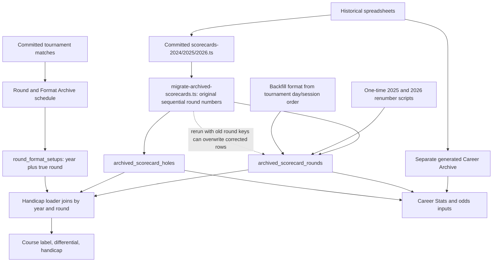

# Historical round archive investigation — September 21, 2026

Status: investigation and local documentation only. Read-only queries ran against the database configured in this workspace. No archive repair, database mutation, or deployment was performed. Re-run the audit before repairing because the database can change.

## Finding

The supplied round information was sufficient. A new CSV is not needed to recover these scores. The system has multiple incompatible meanings of `round`, and the original importer remains able to overwrite the corrected archive using the old numbering.

Confirmed user correction: 2026 round 3 is Fourball at Indian Wells Classic; round 4 is Singles at Indian Wells Cove. Cade's 66 belongs to Classic.

The present database is consistent with the legacy importer having been rerun after the earlier renumbering migrations. The importer code and resulting data pattern support that explanation; this investigation did not retrieve an execution log identifying when or by whom it ran.

## How the archive was built

1. `lib/data/scorecards-2025.ts` and `scorecards-2026.ts` number individual scorecards sequentially. They do not use the full match schedule's round sequence.
2. `scripts/migrate-archived-scorecards.ts` upserts each row using `(tournament_slug, player_slug, round)`, then upserts the hole scores under that row's ID. Its comment says re-running is safe, but it overwrites course and hole values. It omits format when the source lacks one, so an existing format can survive even when the scores now belong to another round.
3. Earlier fixes changed database round numbers to include Alternate Shot sessions in the trip sequence. Danzante's separate individual round became round 0, displayed as Round INDI. `project_specs.md` records those earlier corrections as applied; the database now contains both old-position and corrected-position scorecards.
4. Formats were backfilled from the committed tournament matches. Thus a newly recreated old round 2 can be labeled Alternate Shot even though it contains someone's individual score from a different session.
5. Tee/course/date setup is a separate database row keyed by season year and true round. `getArchivedHandicapRounds` uses that key and prefers the setup's course name over the scorecard's course. It does not check whether the original scorecard course matches the setup course.
6. The Round & Format Archive at the top of Tiger's Career Stats page comes from the match schedule plus these shared setups. The lower Career Stats panel comes from a separate generated archive overlaid with editable database rounds. These panels are not reading a single canonical event record.
7. `mergeCareerRecords` identifies a replacement using year/player/round. That is only valid if both sources use the same round namespace. They currently do not for all 2026 sessions: generated individual Fourball on Pete Dye is round 6, while the corrected handicap/schedule round is 5. Generated Alternate Shot uses round 5. This is a second identity conflict that must be resolved alongside the database repair.

## Verified extent

Full evidence is in `historical-handicap-audit.json`; repeat with `npx tsx scripts/audit-historical-handicap.ts`. The script only reads the database and writes the local report.

| Tournament | Players | Present individual archive rows | Expected from source | Rows with numbering/format issues |
|---|---:|---:|---:|---:|
| Danzante 2025 | 8 | 56 | 40 | 24 |
| Palm Springs 2026 | 12 | 96 | 72 | 60 |

All 152 current rows have exactly one matching original source round when compared by player and the ordered 18 hole scores. Multiple database rows can match the same source round. Matching strokes does not establish that ancillary statistics, uploaded videos, or correction metadata are interchangeable. Those need separate preservation checks before repair.

### Cade, Palm Springs

| Current database round | Raw stored course | Strokes | Current format | Intended true round and format |
|---:|---|---:|---|---|
| 1 | Palmer | 77 | Fourball | 1, Fourball |
| 2 | Classic | 66 | Alt Shot | 3, Fourball |
| 3 | Cove | 78 | Fourball | 4, Singles |
| 4 | Pete Dye | 81 | Singles | 5, Fourball |
| 5 | Pete Dye | 74 | Fourball | 7, Singles; duplicate of current 7 |
| 6 | Tournament | 78 | Alt Shot | 8, Singles; duplicate of current 8 |
| 7 | Pete Dye | 74 | Singles | 7, Singles |
| 8 | Tournament | 78 | Singles | 8, Singles |

Cade's 66 is therefore displayed as Pete Dye because its current round number is 2, and shared setup 2026/2 is Pete Dye. Its differential is blank because the current row's format is Alt Shot. The verified shared setup for Classic already exists at 2026/3 with rating 72.1 and slope 130. The problem is identity, not a missing score or missing Classic tee setup.

### Cade, Danzante

| Current database round | Strokes | Current format | Intended true round |
|---:|---:|---|---|
| 0 | 71 | Individual | 0, Round INDI |
| 1 | 75 | Fourball | 1 |
| 2 | 71 | Alt Shot | 0; duplicate of current 0 |
| 3 | 76 | Fourball | 3 |
| 4 | 75 | Alt Shot | 5, Singles |
| 5 | 76 | Singles | 6; duplicate of current 6 |
| 6 | 76 | Singles | 6 |

Shared Danzante setups exist for rounds 0–6, with dates, Black tees, rating 74.5 and slope 153. The misplaced individual rounds marked Alt Shot explain the missing differentials here. Earlier suggestions that missing tee data was necessarily responsible were unverified and do not describe this confirmed cause.

## Round maps to use in the repair plan

These maps apply to ORIGINAL source numbering, never blindly to today's mixed database numbers.

| Year | Original individual scorecard round | True round | Course | Format |
|---|---:|---:|---|---|
| 2026 | 1 | 1 | Mission Hills Palmer | Fourball |
| 2026 | 2 | 3 | Indian Wells Classic | Fourball |
| 2026 | 3 | 4 | Indian Wells Cove | Singles |
| 2026 | 4 | 5 | Mission Hills Pete Dye | Fourball |
| 2026 | 5 | 7 | Mission Hills Pete Dye | Singles |
| 2026 | 6 | 8 | Mission Hills Tournament | Singles |
| 2025 | 1 | 1 | Danzante Bay | Fourball |
| 2025 | 2 | 0 | Danzante Bay | Individual |
| 2025 | 3 | 3 | Danzante Bay | Fourball |
| 2025 | 4 | 5 | Danzante Bay | Singles |
| 2025 | 5 | 6 | Danzante Bay | Singles |

The reported two Round 5s need a view-specific check. The inspected database contains one row per player/year/round, but duplicate scorecards under different numbers. The separate Career Archive has another round-numbering convention. Do not declare an exact duplicate-label rendering cause verified without inspecting the specific view. Both underlying problems are established.

## Repair sequence for the next session

1. Stop the legacy importer from accepting unconverted round IDs. Give it a shared, explicit source-to-event mapping and an insert-only default that cannot overwrite edited rounds. Do not rerun either old renumbering script against this mixed dataset: they assume uniformly old numbering and are not idempotent.
2. Export a fresh full backup of round rows, hole rows including `host_edited` and timestamps, shared setups, and `archived_shot_videos`. The current audit is evidence, not a complete restore backup. Check live foreign-key dependencies before removing any duplicate. Video and hole rows cascade on parent deletion in the checked-in schema.
3. Produce a per-player, per-round repair plan using ordered hole fingerprints and the source map above. Compare par/yards/putts/FIR/GIR and edits, not just totals. Preserve every distinct scorecard and any newer corrections. Flag ambiguous evidence instead of overwriting it.
4. Decide which existing IDs should survive and how to move attached videos. Apply the approved concrete plan atomically with precondition checks and rollback data; handle occupied round keys without transient collisions. Do not reset hole scores from spreadsheets merely to correct metadata.
5. Align generated Career Archive round identity and its database merge, including the 2026 5/6 distinction and the historical odds replay's format-occurrence mapping. Verify individual and shared-ball data remain separate. Fixing only the handicap UI would leave model and Career Stats inputs inconsistent.
6. Verify 40 unique source rounds for Danzante and 72 for Palm Springs across all players; every score is preserved once. Verify Cade's Classic 66 is round 3 Fourball, Cove 78 is round 4 Singles, Pete Dye 81 is round 5 Fourball, and Danzante's individual/Singles rounds have their proper identities and differentials.
7. Recalculate handicap summaries from corrected identities and assigned tees. Expect displayed handicaps to change; do not force them to their currently corrupted values. Check the scorecard editor, public profiles, match cards, Career Stats, handicap history, and odds consumers.
8. Add idempotence/import/merge tests, update the living workflow guide, deploy the matching code only when ready, and separately verify deployment and live views. A code commit alone cannot repair existing database records.

No fresh CSV is required at this stage. Only genuinely unmatched or disputed rounds would require additional source evidence; none of the current 2025/2026 stroke fingerprints were unmatched in this audit.
